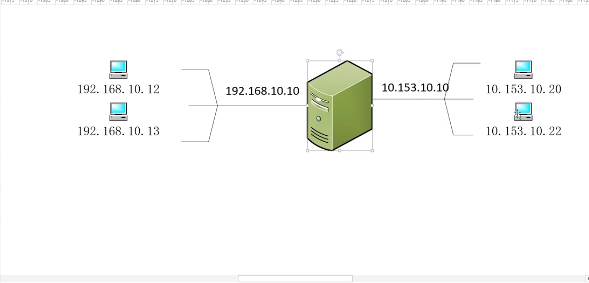
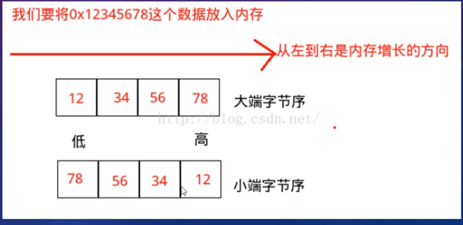
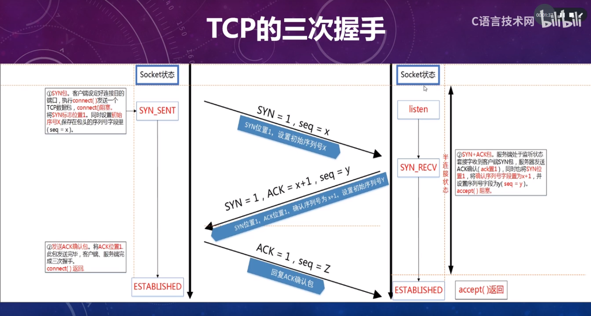

# 第一部分、计算机网络

互联网服务提供者ISP（Internet Service Provider）

互联网交换点IXP（Internet eXchange Point）

互联网协会[W-ISOC]（Internet Society）

互联网体系结构委员会 IAB（Internet Architecture Board）

互联网工程部IETF（Internet Engineering Task Force）

互联网研究部IRTF（Internet Research Task Force）

路由器是实现分组交换的关键构件，其任务是转发收到的分组

电路交换：建立连接->通话->释放连接，传输效率低

分组交换采用存储转发技术，整块数据成为一个报文

**分组交换的优点**

| 优点 | 所采用的手段                                                 |
| ---- | ------------------------------------------------------------ |
| 高效 | 在分组传输过程中动态分配传输带宽，对通信链路是逐段占用       |
| 灵活 | 为每一个分组独立地选择最合适的转发路由                       |
| 迅速 | 以分组作为传送单位，可以不先建立链接就能向其他主机发送分组   |
| 可靠 | 保证可靠性的网络协议；分布式多路由的分组交换网，使网络有很好的生存性 |

问题 ： 分组在各路由器存储转发时需要排队，会造成一定的**时延**

​				各分组必须携带的控制信息也造成了一定的开销。


# 第二部分、Socket

套接字，运行在计算机中的两个程序通过socket建立起一个通道，数据在通道中传输。

socket把复杂的TCP/IP协议族隐藏了起来，对程序员来说，只要用好socket相关的函数，就可以完成网络通信。

socket提供了流（stream）和数据报（datagram）两种通信机制，即流socket和数据报socket。

1. 流socket 基于TCP协议，是一个有序、可靠、双向字节流的通道，传输数据不会丢失、不会重复、顺序也不会错乱。

2. 数据报socket基于UDP协议，不需要建立和维持连接，可能会丢失或错乱。UDP不是一个可靠地协议，对数据的长度有限制，但是它的效率比较高。

实时的音视频聊天可能采用UDP，这种业务可以接收数据的丢失且不必重传。

| 客户端 | 创建流式socket->向服务器发起连接请求->发送/接收数据->关闭socket链接，释放资源:socket()->connect()->send()/recv()->close() |
| ------ | ------------------------------------------------------------ |
| 服务端 | 创建流式socket->指定用于通信的ip地址和端口->把socket设置为监听模式->接收客户端的连接->接收/发送数据->关闭close连接，释放资源:socket()->bind()->listen()->accept()->recv/send()->close() |

## 一、服务端代码

1.linux中，一切皆文件，socket()函数返回值其本质是一个文件描述符，是一个整数。

```c++
//第一步，创建socket
int listenfd;	//文件描述符 0为标准输入，1为标准输出，2为标准错误
if((listenfd = socket(AF_INET,SOCK_STREAM,0))==-1){
    perror("socket"); return -1;
}
```

使用gdb进行调试

```shell
gdb 文件名

set args=xxx #设定参数
b 行数   #设置断点
n 	     #单步调试next
p 变量名 #查看变量值
```

2.服务端绑定地址

```c++
//第二步，把服务端用于通信的地址和端口绑定到socket上
struct sockaddr_in servaddr;			//服务端地址信息的数据结构，
memset(&servaddr,0,sizeof(servaddr));	
servaddr.sin_family = AF_INET;			//协议族，在socket编程中只能是AF_INET
servaddr.sin_addr.s_addr = htonl(INADDR_ANY);	//任意ip地址
//servaddr.sin_addr.s_addr = inet_addr("192.168.190.134");	//指定ip地址
servaddr.sin_port = htons(atoi(argv[1]));	//指定通信端口，使用网络字节顺序
if (bind(listenfd,(struct sockaddr *)&servaddr.sizeof(servaddr)) !=0){
    perror("bind");
    close(listenfd);
    return -1;
}
```



任意ip地址：允许所有的接入服务器的网段连接。

可以不使用网络字节顺序，但是客户端和服务端要保持一致，都要改。

为了保证兼容性，一般使用网络字节顺序。

ip地址和端口不能直接赋值，需要转换。

```c++
//客户端指定服务端的ip地址
struct hostent * h;
if((h = gethostbyname("xxx.xxx.xxx.xxx") == 0)){
	printf("gethostbyname faile.\n");
	close(sockfd);
	return -1;
}
//客户端指定服务端的通信端口
servaddr.sin_port = htons(5000);
```

3.把socket设置为监听模式（主动模式和被动模式）

```c++
//第三步：把scoket设置为监听模式,设置完成后此时客户端已经可以与服务端进行连接，客户端发送的报文存在与缓冲区，等待服务端响应（accept()）。
if(listen(listenfd,5)!=0){
	perror("listen");
	close(listenfd);
	return -1;
}
```

4.接受客户端的连接

```c++
//第四步：接受客户端的连接
int clientfd;
int socklen = sizeof(struct sockaddr_in);
struct sockaddr_in clienraddr;
//当服务端启动时，若没有客户端进行连接，则服务端会停在accept处
//listenfd只用来监听，真正与客户端进行交互的是clientfd，两个都是socket,accept会返回一个socket
clientfd=accept(listenfd,(struct sockaddr *)&clientaddr,(socklen_t*)&socklen);
printf("客户端(%s)已连接。\n",inet_ntoa(clientaddr.sin_addr));
```

5.与客户端通信，接收客户端发过来的报文并回复ok

```c++
//第五步：与客户端通信，接收客户端发过来的报文后，回复ok
char buffer[1024];
while(1){
    int iret;
    memset(buffer,0,sizeof(buffer));
    if((iret = recv(clientfd,buffer,sizeof(buffer),0))<=0){	//接收客户端的请求报文
        printf("iret=%d\n",iret);
        break;
        
    }
}
```


## 二、客户端代码

```c++
//第一步，创建客户的socket
//客户端只有一个socket
int sockfd;
if((sockfd = socket(AF_INET,SOCK_STREAM,0))==-1){
    perror("socket");
    return -1;
}
```

```c++
//第二步：向服务器发起请求
struct hostent *h;
if((h = gethostbyname(argv[1])) == 0){	//指定服务端ip地址
    printf("gethostbyname faild.\n");
    close(sockfd);
    return -1;
}
struct sockaddr_in servaddr;
memset(&servaddr,0,sizeof(servaddr));
servaddr.sin_family = AF_INET;
servaddr.sin_port = htons(atoi(argv[2]));	//指定服务端的通信端口
memcpy(&servaddr,sin_addr,h->h_addr,h->h_length);
/*向服务端发起连接请求*/
/*为什么不直接使用servaddr.sin_addr.s_addr=inet_addr(argv[1]);呢*/
if(connect(sockfd,(struct sockaddr *)&servaddr,sizeof(servaddr)) !=0 ){
    perror("connect");
    close(sockfd);
    return -1;
}
char buffer[1024];
```

```c++
//第三步：与服务端通信，发送一个报文后等待回复，然后再发送下一个报文。
for(int ii=0 ; ii<3 ; ii++){
    int iret;
    memset(buffer,0,sizeof(buffer));
    sprintf(buffer,"这是第%d个超级女生，编号%03d。",ii+1,ii+1);
    if((iret=send(sockfd,buffer,strlen(buffer),0))<=0){	//向服务器发送请求报文
        perror("senssized");
        break;
    }
    printf("发送：%s\n",buffer);
    
    memset(buffer,0,sizeof(buffer));
    if((iret = recv(sockfd,buffer,sizeof(buffer),0))<=0){	//接受服务端的回应报文
        printf("iret=%d\n",iret);
        break;
    }
    printf("接收：%s\n",buffer);
}
```

## 三、send()函数

send函数用于把数据通过socket发送给对端。不论是客户端还是服务端，应用程序都用send函数来向TCP连接的另一端发送数据。

```c++
ssize_t send(int sockfd,const void *buf,size_t len,int flags);
```

buf为需要发送的数据的内存地址，可以是基本数据类型变量的地址。

函数返回已发送的字符数，出错时返回-1，错误信息errno被标记。

send()在缓冲区满了之后，会进入等待（被阻塞），当缓冲区减少一部分之后（被接收），阻塞状态会解除，继续发送。

send()存在写入不完整情况，原因：缓冲区不足等。循环调用多次可解决问题，判断是否写完。

**注意，就算是网络断开，或socket已被对方关闭，send函数不会立即报错，要过几秒才会报错。**

## 四、recv()函数

recv函数用于接收对端通过socket发送过来的数据。不论是客户端还是服务端，应用程序都用recv函数接受来自TCP连接的另一端发送过来的数据。

```c++
ssize_t recv(int scokfd, void *buf, size_t len, int flags);
```

函数返回已发送的字符数，出错时返回-1，失败时不会设置errno的值。

如果socket的对端没有发送数据，recv就会等待，如果socket被对端关闭，返回值为0。

如果recv返回错误表示通道已不可用。

存在读取数据不完整的情况，因为TCP可能存在分包，所以应该使用一个循环多次调用使其读取完整的数据，判断返回值是否等于报文长度，若小于则继续循环。

## 五、程序退出时先关闭socket

​		socket是系统资源，操作系统打开的socket数量是有限的，在程序退出之前必须关闭已打开的socket，就像关闭文件指针一样，就像delete已分配的内存一样，极其重要。

​		值得注意的是，关闭socket的代码不能只在main函数的最后，那是程序运行的理想状态，还应该在main函数的每个return之前关闭。

## 六、socket()函数

用于创建一个新的socket，即向系统申请一个socket资源。socket函数用户：客户端和服务端。

```c++
int socket(int domain,int type,int protocol);
```

​		domain：协议域，又称协议族（family）。常用的协议族有AF_INET、AF_INET6、AF_LOCAL（或称AF_UNIX，Unix域Socket）、AF_ROUTE等。协议族决定了socket的地址类型，在通信中必须采用对应的地址，如AF_INET决定了要用ipv4地址（32位的）与端口号（16位的）的组合、AF_UNIX决定了要用一个绝对路径名作为地址。

​		type：指定socket类型。常用的socket类型有SOCK_STREAM、SOCK_DGRAM、SOCK_RAW、SOCK_PACKET、SOCK_SEQPACKET等。流式socket（SOCK_STREAM）是一种面向连接的socket，针对于面向连接的TCP服务应用。数据报式socket（SOCK_DGRAM）是一种无连接的socket，对应于无连接的UDP服务应用。

​		protocol：指定协议。常用协议有IPPROTO_TCP、IPPROTO_UDP、IPPROTO_STCP、IPPROTO_TIPC等，分别对应TCP传输协议、UDP传输协议、STCP传输协议、TIPC传输协议。

除非系统资料耗尽，socket函数一般不会返回失败。

返回值：成功则返回一个socket，失败返回-1，错误原因存于errno 中。

socket从3开始，在gdb单步调试中从7开始。（教程上是这么说，但在我的电脑上运行都是3）打开默认的文件描述符。

socket一个文件中打开文件描述符最多为1024个，即linux对打开文件数目的限制数，使用

```shell
ulimit -a
```

进行查看

可以通过修改linux打开文件数目上限值进行修改。

```shell
ulimit -HSn 2000	#将一个进程中的文件上限临时修改为2000
```

## 七、主机字节序与网络字节序

字节顺序是指占内存<u>多于一个字节</u>类型的数据在内存中的存放数据，一个32位整数由4个字节组成。

### 1.小端字节序（little-endian）：

将低序字节存储在起始地址

​	x86_64、ARM架构采用的是小端模式

### 2.大端字节序（big-endian）：

将高序字节存储在起始地址

​	Power PC、MIPS UNIX和HP-PA UNIX采用大端模式



### 3.网络字节序

网络字节序是TCP/IP中规定好的一种数据表示格式，可以保证数据在不同主机直接传输时能够被正确解释，采用大端排序方式

### 4.主机字节序

数据的顺序由cpu决定，与操作系统无关。

即使是同一台机器上的两个进程通信，也要考虑字节序的问题（JVM）采用大端字节序。

网络字节序和主机字节序的转换函数：

htons()、ntohs()、htonl()、ntohl()

htons()和ntohs()完成16位无符号数的相互转换，htonl()和ntohl()完成32位无符号数的相互转换。

host to network short	host to network long	network to host short	network to host long

### 5.地址和端口

TCP协议中的主机地址和端口采用整数表示，最大不超过255

192.168.190.134

转换为2进制：

11000000 10101000 10111110 10000110

转换为十进制：

3232284294

转换为大端2进制：

10000110 10111110 10101000 11000000

转换为大端十进制（网络字节序）：

2260641984

## 八、socket结构体

```c++
struct sockaddr{				//旧的
    unsigned short sa_family;	//地址类型，AF_XXX
    char sa_data[14];			//14字节的端口和地址
};
struct sockaddr_in{					//新的
    short int sin_family;			//地址类型
    unsigned short int sin_port;	//端口号
    struct in_addr sin_addr;		//地址
    unsigned char sin_zero[8];		//为了保持新的结构体与struct sockaddr一样的长度，可以强制转换
};

struct in_addr{
    unsigned long s_addr;	//地址
}

```

## 九、hostnet结构体

```c++
struct hostent{
    char *h_name;			//主机名
    char **h_aliases;		//主机所有别名构成的字符串数组，同一IP可绑定多个域名。
    int h_addrtype;			//主机IP地址的类型，例如IPV4（AF_INET），IPV6
    int h_length;			//主机IP地址长度，IPV4地址为4，IPV6地址为6
    char **h_addr_list;		//主机的IP地址，以网络字节序存储
};
#define h_addr h_addr_list[0]/*for backward compatibility*/
//gethostbyname函数可以利用字符串格式的域名获得IP网络字节顺序地址。
struct hostent *gethostbyname(const char *name);
```

```c++
/*为什么不直接使用servaddr.sin_addr.s_addr=inet_addr(argv[1]);呢*/
/*看hostent结构体便知*/
/*s_addr为long类型，无法存储字符，若是遇到别名则不能进行解析，导致连接失败。*/
/*由gethostbyname函数将获取到的主机名中的信息进行提取，最后返回一个hostent*/
/*memcpy为内存复制，将h中的h_addr_list拷贝到sin_addr中*/
struct hostent *h;
if((h = gethostbyname(argv[1])) == 0){	//指定服务端ip地址
    printf("gethostbyname faild.\n");
    close(sockfd);
    return -1;
}
memcpy(&servaddr,sin_addr,h->h_addr,h->h_length);
```

## 十、bind()函数

```c++
 int bind(int sockfd, const struct sockaddr *addr,socklen_t addrlen);
```

在服务端代码中，若是使用了sockaddr_in作为服务端地址信息的数据结构，那么，在bind函数中需要将其强制转换为sockaddr结构体,（accept同理）

```c++
struct sockaddr_in servaddr;
if(bind(listenfd,(struct sockaddr *)&servaddr , sizeof(servaddr))!=0)
```

## 十一、inet_aton()函数

```c++
int inet_aton(const char *cp,struct in_addr *inp);
```

将一个字符串IP地址转换为一个32位的网络字节序IP地址，如果这个函数成功，返回值非零，失败返回值为0。使用这个函数没有错误码存放在errno中，所以它的返回值会被忽略。

## 十二、*inet_ntoa()函数

```c++
char *inet_ntoa(struct in_addr in);
```

把网络字节的IP地址转换成字符串的IP地址。

## 十三、inet_addr()函数

```c++
in_addr_t inet_addr(const char *cp);
```

## 十四、errno

errno 是记录系统的最后一次错误代码。代码是一个int型的值，在errno.h中定义。查看错误代码errno是调试程序的一个重要方法。当linux C api函数发生异常时,一般会将errno变量(需include errno.h)赋一个整数值,不同的值表示不同的含义,可以通过查看该值推测出错的原因。在实际编程中用这一招解决了不少原本看来莫名其妙的问题。

## 十五、端口号

0~65535，其中：

​		1024（0-1023）以下为知名端口（Well-Known Ports），即众所周知的端口号，这些端口号一般固定分配给一些服务。比如21端口分配给FTP服务，25端口分配给SMTP（简单邮件传输协议）服务，80端口分配给HTTP服务，135端口分配给RPC（远程过程调用）服务等等。0为预留端口号。在socket中也可以使用，需要使用root权限。

​		1024-65535为动态端口（Dynamic Ports），这些端口号一般不固定分配给某个服务，也就是说许多服务都可以使用这些端口。只要运行的程序向系统提出访问网络的申请，那么系统就可以从这些端口号中分配一个供该程序使用。比如1024端口就是分配给第一个向系统发出申请的程序。在关闭程序进程后，就会释放所占用的端口号。

## 十六、设置服务端socket的SO_REUSEADDR属性

服务端程序的端口释放后可能会处于TIME_WAIT状态，等待两分钟之后才能再被使用，SO_REUSEADDR是让端口释放后立即就可以再次被使用。

```c++
//设置SO_REUSEADDR
int opt=1;
unsigned int len=sizeof(opt);
setsockopt(listenfd,SQL_SOCKET,SO_REUSEADDR.&opt,len);
```

## 十七、listen()函数

listen函数把主动连接socket变为被动连接的socket，使得这个socket可以接受其它socket的连接请求，从而成为一个服务端的socket。

## 十八、accept()函数

服务端接受客户端的连接。准确来说是从已经准备好的连接队列中获取一个连接请求，如果队列为空，accept将阻塞。

```c++
int accept(int sockfd,struct sockaddr *addr,socklen_t *addrlen);
```

参数sockfd是已经被listen过的socket。

参数addr用于存放客户端的地址信息，用sockaddr结构体表达，如果不需要客户端的地址，可以填0。

参数addrlen用于存放addr参数的长度，如果addr为0，addrlen也填0。

accept函数等待客户端的连接，如果没有客户端连上来，它就一直等待，这种方式称之为阻塞。

accept等待到客户端的连接后，创建一个新的socket，函数返回值就是这个新的socket，服务端使用这个新的socket和客户端进行报文的收发。

返回值：成功则返回0，失败返回-1，错误原因存于errno 中。

accept在等待的过程中，如果被中断或其它的原因，函数返回-1，表示失败，如果失败，可以重新accept。

## 十九、connect()函数

向服务器发起连接请求

```c++
int connect(int sockfd, struct sockaddr * serv_addr, int addrlen);
```

函数说明：connect函数用于将参数sockfd 的socket 连至参数serv_addr 指定的服务端，参数addrlen为sockaddr的结构长度。

返回值：成功则返回0，失败返回-1，错误原因存于errno 中。

connect函数只用于客户端。

如果服务端的地址错了，或端口错了，或服务端没有启动，connect一定会失败。

## 二十、TCP的三次握手



linux内核会为listen状态的socket维护两个队列：不完全连接请求队列（SYN_RECV状态）和等待accept建立起socket的队列（ESTABLISHED状态）

在Linux内核2.2之后，backlog参数的行为改变了，现在它指等待accept的完全建立的socket的队列长度，而不是不完全连接请求的数量。不完全连接队列的长度可以使用/procc/sys/net/ipv4/tcp_max_syn_backlog设置（缺省值128，我的是2048）。

backlog参数如果小于不完全连接队列的长度，则截断。

使用

```shell
netstat -参数
```

来查看握手是否成功

```shell
tcp       28      0 127.0.0.1:5005          127.0.0.1:55626         ESTABLISHED
tcp        0      0 127.0.0.1:55626         127.0.0.1:5005          ESTABLISHED
```

ESTABLISHED表示握手成功。若为SYN_RECV则表示在半连接状态。

客户端不存在半连接状态，所以监听之后直接就进入了ESTABLISHED，可以收发报文。

客户端地址问题：客户端连接成功时返回的并不一定是服务器的地址。因为客户端只能看到已连接的互联网IP的出口地址。

## TCP报文分包和粘包

### 分包

发送方发送字符串“helloworld”，接收方却接收到了连个字符串“hello”和“world”。

### 粘包

发送方发送两个字符串“hello”+“world”。接收方却一次性接收到了“helloworld”。

### TCP传输数据能保证：

#### 1.顺序不变。

例如发送hello，对方一定能接收到hello而不是olleh，这是TCP协议承诺的。

#### 2.分割的包中间不会插入其他数据。

在实际开发中，为了解决分包和粘包的问题，就一定要自定义一份协议，最常用的方法是：

报文长度+报文内容						0010helloworld		报文长度可以用ascii码，四位十进制整数