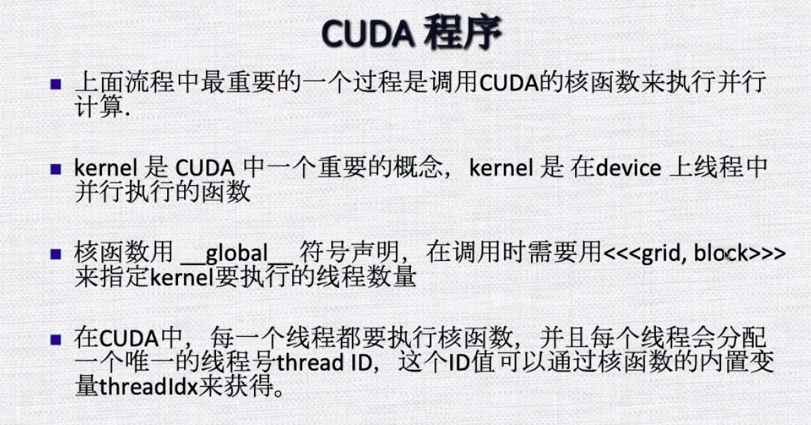

# CUDA程序执行流程

1.分配host内存，并进行数据初始化；

2.分配device内存，并从host将数据拷贝到device上；

3.调用CUDA的核函数在device上完成指定的运算；

4.将device上的运算结果拷贝到host上（性能）；

5.释放device和host上分配的内存。



**warp**:32个线程一组，是第三个层次。

```c++
//kernel定义
__global__void vec_add(double *x,double *y,double *z,int n){
    int i = get_tid(); //user-defind macro/functuion

    if(i<n){
        z[i] = x[i] + y[i];
    }
}

int main(){
    int N = 1000000; //1M
    int bs = 256;
    int gs = (N+bs-1)/bs;

    //kernel,call GPU
    vec_add<<<gs,bs>>>(x,y,z,N);
}
```

grid和block都是定义为dim3类型的变量，可以灵活地定义为1-dim，2-dim，3-dim结构。

dim3可以看成是包含三个无符号整数(x,y,z)成员的结构体变量，缺省值为1。

不同GPU架构，grid和block维度有限制。

GPU是异构模型，所以要区分host和device上的代码。

```markdown
__global__ 在device上执行，从host中调用（一些特定的GPU也可以从device上调用），返回值类型必须是void，不支持可变参数，不能成为类成员函数。

用__global__定义的kernel是异步的，这意味着host不会等待kernel执行完成，直接执行下一步。
__device__：在device上执行，仅可以从device中调用，不可以和__global__同时用。
__host__:在host上执行，单仅可以从device中调用，不可以和__global__同时用，但可以和__device__同时使用，此时函数会在device和host都编译。
```

CUDA内置变量

一个线程需要两个内置的坐标变量（blockIdx，threadIdx）来唯一标识，都是dim3的变量。

blockIdx指明线程所在grid中的位置，而threadIdx指明线程所在block中的位置，都包含三个值：xxx.x xxx.y xxx.z

一个线程块上的线程是放在同一个流式多处理器（SM）上的。

blockDim，获取线程块各个维度的大小。

gridDim,获取网格块各个维度的大小。

```c++
/*get thread id:1D block and 2D grid*/
#define get_tid()(blockDim.x * (blockIdx.x + blockIdx.y * gridDim.x) + threadIdx.x)

/*get block id :2D grid*/
#define get_bid() (blockIdx.x + blockIdx.y * gridDim.x)


__global__void vec_add(double *x,double *y,double *z,int n){
    int i = get_tid(); //user-defind macro/functuion

    if(i<n){
        z[i] = x[i] + y[i];
    }
}
```

