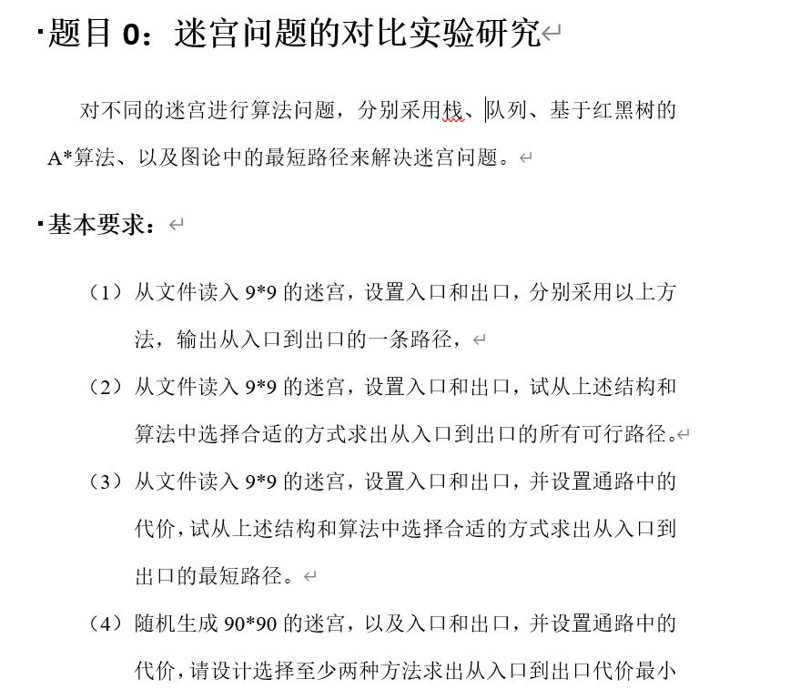
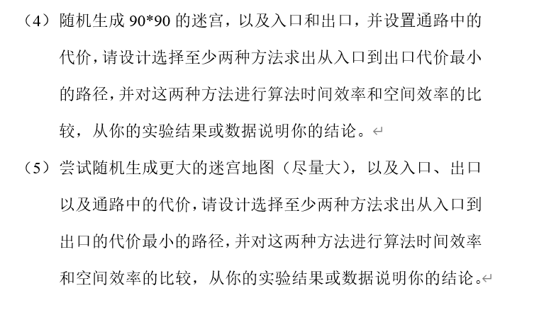

# 思路


1. ~~桟实现(深度优先搜索)~~
   ~~用桟来保存有多个方向的节点，若是走到死路，则将最近的一个节点弹出 ，重新选择路线。~~

2. ~~队列实现(广度优先搜索)~~
   ~~用队列保存点的所有邻居点，并依次弹出邻居点，寻找邻居的邻居，以此类推，直到找到终点。~~

3. ~~A*算法~~

4. ~~最短路径算法~~

# 题目



# 地图

```
0 0 0 0 1 1 1 1 0
0 0 0 1 1 0 0 1 0
0 0 0 1 0 1 1 1 0
0 0 0 1 1 1 0 0 0
0 0 0 0 1 0 0 0 0
0 0 0 0 1 0 0 0 0
0 0 0 1 1 0 0 0 0
0 0 0 1 1 0 0 0 0
0 0 1 1 0 0 0 0 0
```


# 源码

## 第一题：

### stack

```c
//by stack

#include<stdio.h>
#include<stdlib.h>
/*************************************Stack begin***************************************/
//定义一个迷宫位置的数据类型，主要存放坐标
typedef struct{
    int x,y;
}dataType; 

//一个结点
struct node{
    dataType location;
	struct node *next; //指向下一个数据元素的指针 
};

//链式栈
typedef struct node *PtrToNode;
typedef PtrToNode Stack;

/*
   函数名：isEmpty 
   函数功能：判定栈是否为空 
   函数参数：栈头结点指针 
   返回值：若栈为空，则返回1，否则返回0
*/
int isEmpty(Stack s) 
{
    return  s->next ==NULL;
}
/*
   函数名：createStack 
   函数功能：创建一个空栈，实际上只需要初始化栈头结点 
   函数参数：无 
   返回值：栈头结点指针 
*/
Stack createStack(void)  
{
	Stack s ;
	s =(Stack)malloc(sizeof(struct node));
	s->next = NULL;
	s->location.x = 0;
    s->location.y = 0;
	return s;
}

/*
   函数名：push 
   函数功能：向栈中压人一个数据元素值为x 
   函数参数：待压栈的数据元素，栈头结点指针 
   返回值：无
*/
void push(dataType coordinate,Stack s) 
{
	//表头作为栈顶
    PtrToNode temp ;
 	temp=(PtrToNode)malloc(sizeof(struct node));
 	temp->location.x = coordinate.x;
    temp->location.y = coordinate.y;
 	temp->next = s->next;
 	s->next = temp;
}

/*
   函数名：pop 
   函数功能：弹出栈顶元素并返回元素值 
   函数参数：栈头结点指针 
   返回值：坐标值 
*/
dataType pop(Stack s) 
{
	PtrToNode temp;
	if(isEmpty(s)==0)
    {
        temp = s->next;
        dataType t;
        t.x = temp->location.x;
        t.y = temp->location.y;
        s->next = temp->next;
        free(temp);
        return t;
    }
}
/*************************************Stack end***************************************/

/*******************************global declarations***********************************/
int set_OK = 0; //一个flag，用于检测起点和终点是否成功设置。
int maze_row=0; //地图的行数.
int maze_colum=0; //地图的列数.
int i=0,j=0; //循环变量.
char** load_maze(char* file_location); //载入地图文件.
void set_startP_and_endP(char** maze, dataType* start_point,dataType* end_point); //设置起点和终点.
void depth_first_search(Stack s,char **maze,dataType start,dataType end); //走迷宫，使用深度优先算法.
int side_way_num(char **maze,dataType location); //判断岔路个数.

/****************************************main****************************************/
int main(){
    char *  file_location=NULL;         //定义一个文件路径字符串
    char ** maze;                       //二维字符数组，用作地图
    dataType start;                     //一个起点
    dataType end;                       //一个终点
    start.x = start.y = end.x = end.y = -1;     //将起点和终点坐标初始化为-1
    Stack track = NULL;                 //路径栈
    track = createStack();              //开辟一个栈空间
    file_location = (char*)malloc(sizeof(char)*50); //为文件路径字符串分配空间
    printf("Please input the file path of the maze:\n");
    while(set_OK == 0){
        scanf("%s",file_location);          //输入文件所在路径，绝对路径
        maze = load_maze(file_location);    //载入迷宫
    }
    set_OK =0;
    printf("Please set start point and end point.\n");
    while(1){           //进行循环直到成功设置起点和终点
        set_startP_and_endP(maze,&start,&end);
        if(set_OK == 1){
            set_OK=0;
            break;
        }
    }
    push(end,track);    //起点入栈
    depth_first_search(track,maze,start,end);
    system("pause");
    return 0;
}

char** load_maze(char* file_location){
    FILE *fp=NULL;
    char** maze;
    char tmp = 0;
    int flag = 0;   //为了防止列计数超过列值。
    if((fp = fopen(file_location,"r"))==NULL){
        perror("Faild to load maze");
        return NULL;
    }
    while(!feof(fp)){
        tmp = fgetc(fp);
        if(tmp == '\n'){
            ++maze_row;
            flag = 1;
        }
        if(tmp>=48&&tmp<=57&&flag == 0){
            ++maze_colum;
        }
    }
    rewind(fp); //文件指针复位
    maze = (char **)malloc(sizeof(char*)*maze_row);

    for(i=0;i<maze_colum;i++){
        maze[i] = (char *)malloc(sizeof(char)*maze_colum);
    }

    i=0;

    while(i<maze_row){
        j=0;
        while(j<maze_colum){
            tmp = fgetc(fp);
            if(tmp <48 || tmp >57) continue;
            maze[i][j] = tmp;
            j++;
        }
        i++;
    }
    printf("maze colum:%d,maze_row:%d\n",maze_colum,maze_row);
        for(i=0;i<maze_row;i++){
        for(j=0;j<maze_colum;j++){
            printf("%c ",maze[i][j]);
        }
        printf("\n");
    }
    printf("Finished loading.\n");
    fclose(fp);
    set_OK =1;
    return maze;
}

void set_startP_and_endP(char** maze, dataType* start_point,dataType* end_point){    

    //确定起点坐标
    if(start_point->x < 0||start_point->y < 0){
        printf("Start point(x,y):");
        scanf("%d,%d",&start_point->x,&start_point->y);
        if(start_point->x<0||start_point->y<0){
            printf("Input range error(0 ~ mazeSize-1),Please try again.\n");
            start_point->x = start_point->y = -1;
            return;
        }
    }  
    if(maze[start_point->y][start_point->x]!='1'){
        printf("Wrong start location!Please try again.\n");
        start_point->x = start_point->y = -1;
        return;
    }

    //确定终点坐标
    if(end_point->x < 0||end_point->y < 0){
        printf("End point(x,y):");
        scanf("%d,%d",&end_point->x,&end_point->y);
        if(end_point->x<0||end_point->y<0){
            printf("Input range error(0 ~ mazeSize-1),Please try again.\n");
            return;
        }
    }  
    if(maze[end_point->y][end_point->x]!='1'){
        printf("Wrong end location! Please try again.\n");
        end_point->x = end_point->y = -1;
        return;
    }
    printf("Set complete.\n");
    set_OK =1;
}

//使用栈进行迷宫反向遍历，深度优先遍历
void depth_first_search(Stack s,char **maze,dataType start,dataType end){
    dataType temp;
    int sideWays=0;
    int moveFlag; //确保一次循环只移动一次
    while(!isEmpty(s)){ //若栈不为空进入循环
        moveFlag=0;
        temp = pop(s);  //弹出顶部
        if(temp.x == start.x && temp.y == start.y){ //判断是否和起点坐标相等
            printf("The track of the maze is: \nstart->");  //逆序打印坐标
            while(!isEmpty(s)){
                printf("(%d,%d)->",temp.x,temp.y);
                temp = pop(s);
            }
            printf("(%d,%d)->",end.x,end.y);
            printf("end\n");
            return;
        }
        sideWays = side_way_num(maze,temp);
        if(sideWays==0){
            continue;
        }
        push(temp,s); //获取顶部元素信息后再压回栈

        maze[temp.y][temp.x]='2';
        //按照顺序进行搜索
        if(temp.x+1<maze_colum && moveFlag==0){
            if( maze[temp.y][temp.x+1] == '1'){
                temp.x = temp.x+1;
                push(temp,s);       //入栈
                maze[temp.y][temp.x] = '2'; //设置走过的标记
                moveFlag=1;
                continue;
            }
            if(temp.y+1<maze_colum && moveFlag==0){
                if( maze[temp.y+1][temp.x+1] == '1'){
                    temp.x = temp.x+1;
                    temp.y = temp.y+1;
                    push(temp,s);       //入栈
                    maze[temp.y][temp.x] = '2'; //设置走过的标记
                    moveFlag=1;
                    continue;
                }
            }
            if(temp.y-1>=0 && moveFlag==0){
                if( maze[temp.y-1][temp.x+1] == '1'){
                    temp.x = temp.x+1;
                    temp.y = temp.y-1;
                    push(temp,s);       //入栈
                    maze[temp.y][temp.x] = '2'; //设置走过的标记
                    moveFlag=1;
                    continue;
                }
            }
        }
        if(temp.y+1<maze_row && moveFlag==0){
            if( maze[temp.y+1][temp.x] == '1'){
                temp.y = temp.y+1;
                push(temp,s);
                maze[temp.y][temp.x] = '2';
                moveFlag=1;
                continue;
            }
            if(temp.x-1>=0 && moveFlag==0){
                if( maze[temp.y+1][temp.x-1] == '1'){
                    temp.y = temp.y+1;
                    temp.x = temp.x-1;
                    push(temp,s);
                    maze[temp.y][temp.x] = '2';
                    moveFlag=1;
                    continue;
                }
            }
        }
        if(temp.x-1>=0 && moveFlag==0){
            if( maze[temp.y][temp.x-1] == '1'){
                temp.x = temp.x-1;
                push(temp,s);
                maze[temp.y][temp.x] = '2';
                moveFlag=1;
                continue;
            }
            if(temp.y-1>=0 && moveFlag==0){
                if( maze[temp.y-1][temp.x-1] == '1'){
                    temp.x = temp.x-1;
                    temp.y = temp.y-1;
                    push(temp,s);
                    maze[temp.y][temp.x] = '2';
                    moveFlag=1;
                    continue;
                }
            }
        }
        if(temp.y-1>=0 && moveFlag==0){
            if( maze[temp.y-1][temp.x] == '1'){
                temp.y = temp.y-1;
                push(temp,s);
                maze[temp.y][temp.x] = '2';
                moveFlag=1;
                continue;
            }
        }

    }
    printf("This maze has no track.\n");
    return;
}

//判断是否有岔路
int side_way_num(char **maze,dataType location){
    int sideWay=0;
    //向右进行探索
    if(location.x+1<maze_colum){
        if(maze[location.y][location.x+1] == '1'){
            ++sideWay;  
        }
    }

    //向左进行探索
    if(location.x-1>=0){
        if( maze[location.y][location.x-1] == '1'){
            ++sideWay;
        }
    }

    //向上进行探索
    if(location.y-1>=0){
        if( maze[location.y-1][location.x] == '1'){
            ++sideWay;
        }
    }

    //向下进行探索
    if(location.y+1<maze_row){
        if( maze[location.y+1][location.x] == '1'){
            ++sideWay;
        }
    }
    return sideWay;
}
```

### queue

```c
#include<stdio.h>
#include<stdlib.h>
/*************************************Queue begin***************************************/
//定义一个迷宫位置的数据类型，主要存放坐标
typedef struct{
    int x,y;
    int pre; //保存上一个位置的下标
}dataType; 
//队列数据元素结构
typedef struct node
{
    dataType location;
    struct node *next;
}QueueData;

typedef struct queueRecord
{
    QueueData  *front, *rear ;
}LINKQUEUE;
typedef struct queueRecord *PQueue;

PQueue createEmptyQueue( )
{
   //创建一个空队列，实质：生成一个LINKQUEUE类型的结点，并给front 和 rear 成员赋值
    PQueue pqu;
    pqu=(PQueue)malloc(sizeof(struct queueRecord));
    if(pqu!=NULL)
    {
        pqu->front=NULL;
        pqu->rear=NULL;
    }
    else
    {
        printf("Out of space!\n");
    }
    return pqu;
    
}

int isEmptyQueue(PQueue  queue)
{ //判定队列是否为空，实质： 看队列的front指针是否为空，若为空，则队列为空
    if(queue->front==NULL)
    {
        return 1;
    }
    else
    {
        return 0;
    }
}

void enQueue(dataType x, PQueue queue)
{
   //将数据元素x插入队尾。
    struct node *p;
    p=(struct node *)malloc(sizeof(struct node));
    if(p==NULL)
    {
        printf("Out of space!\n");
    }
    else
    {
        p->location=x;
        p->next=NULL;
        if(queue->front==NULL)
        {
            queue->front=p;
        }
        else
        {
            queue->rear->next=p;
        }
        queue->rear=p;
    }
}

dataType deQueue(PQueue Q)
{
     //出队，实质： 取出Q队列的队首结点，返回该结点的数据元素
    struct node *head=Q->front;
    Q->front=Q->front->next;
    return head->location;
    /*-------end----------*/
}

/*************************************Queue end***************************************/

/*******************************global declarations***********************************/
int set_OK = 0;            //一个flag，用于检测文件、起点和终点是否成功设置。
int maze_row=0;            //地图的行数
int maze_colum=0;          //地图的列数
int i=0,j=0,k=0,l=0;               //循环变量
char** load_maze(char*);   //载入地图文件
void set_startP_and_endP(char** , dataType* , dataType*);   //设置起点和终点
void Breadth_first_search(PQueue ,char **,dataType,dataType);  //走迷宫，使用广度优先算法
void walk(char** ,PQueue ,int ,int,int* );
void print_track(dataType *,int);
int check_end(dataType  , dataType );

/****************************************main****************************************/
int main(){
    char *  file_location=NULL;         //定义一个文件路径字符串
    char ** maze;                       //二维字符数组，用作地图
    dataType start;                     //一个起点
    dataType end;                       //一个终点
    start.x = start.y = end.x = end.y = -1;     //将起点和终点坐标初始化为-1
    PQueue pq = NULL;                 
    pq = createEmptyQueue();              //开辟一个队列空间
    file_location = (char*)malloc(sizeof(char)*50); //为文件路径字符串分配空间
    printf("Please input the file path of the maze(9x9):\n");
    while(set_OK == 0){
        scanf("%s",file_location);          //输入文件所在路径，绝对路径
        maze = load_maze(file_location); 
    } 
    set_OK = 0;  
    printf("Please set start point and end point.\n");
    while(1){
        set_startP_and_endP(maze,&start,&end);
        if(set_OK == 1){
            set_OK=0;
            break;
        }
    }
    end.pre = -1;
    enQueue(end,pq);
    Breadth_first_search(pq,maze,start,end);
    system("pause");
    return 0;
}

char** load_maze(char* file_location){
    FILE *fp=NULL;
    char** maze;
    char tmp = 0;
    int flag = 0;
    if((fp = fopen(file_location,"r"))==NULL){
        perror("Faild to load maze");
        return NULL;
    }
    while(!feof(fp)){
        tmp = fgetc(fp);
        if(tmp == '\n'){
            ++maze_row;
            flag = 1;
        }
        if(tmp>=48&&tmp<=57&&flag == 0){
            ++maze_colum;
        }
    }
    rewind(fp);
    maze = (char **)malloc(sizeof(char*)*maze_row);
    for(i=0;i<maze_colum;i++){
        maze[i] = (char *)malloc(sizeof(char)*maze_colum);
    }
    i=0;
    while(i<maze_row){
        j=0;
        while(j<maze_colum){
            tmp = fgetc(fp);
            if(tmp <48 || tmp >57) continue;
            maze[i][j] = tmp;
            j++;
        }
        i++;
    }
    printf("maze colum:%d,maze_row:%d\n",maze_colum,maze_row);
    for(i=0;i<maze_row;i++){
        for(j=0;j<maze_colum;j++){
            printf("%c ",maze[i][j]);
        }
        printf("\n");
    }
    printf("Finished loading.\n");
    set_OK = 1;
    fclose(fp);
    return maze;
}

void set_startP_and_endP(char** maze, dataType* start_point,dataType* end_point){    

    //确定起点坐标
    if(start_point->x < 0||start_point->y < 0){
        printf("Start point(x,y):");
        scanf("%d,%d",&start_point->x,&start_point->y);
        if(start_point->x<0||start_point->y<0){
            printf("Input range error(0 ~ mazeSize-1),Please try again.\n");
            return;
        }
    }  
    if(maze[start_point->y][start_point->x]!='1'){
        printf("Wrong start location!Please try again.\n");
        start_point->x = start_point->y = -1;
        return;
    }

    //确定终点坐标
    if(end_point->x < 0||end_point->y < 0){
        printf("End point(x,y):");
        scanf("%d,%d",&end_point->x,&end_point->y);
        if(end_point->x<0||end_point->y<0){
            printf("Input range error(0 ~ mazeSize-1),Please try again.\n");
            return;
        }
    }  
    if(maze[end_point->y][end_point->x]!='1'){
        printf("Wrong end location! Please try again.\n");
        end_point->x = end_point->y = -1;
        return;
    }


    printf("Set complete.\n");
    set_OK =1;
}

//使用队列进行迷宫逆向遍历，广度优先遍历
void Breadth_first_search(PQueue q,char **maze,dataType start,dataType end){
    dataType temp;
    dataType points[maze_row*maze_colum];
    int idx=0;//idx为上一个元素的下标。
    //int moveFlag;
    while(!isEmptyQueue(q)){
        //moveFlag = 0;
        temp = deQueue(q);
        points[k++] = temp;
        maze[temp.y][temp.x] = '2';
        
        if(temp.x+1<maze_colum){
            walk(maze,q,temp.x+1,temp.y,&idx);
            if(temp.y+1<maze_colum){
                walk(maze,q,temp.x+1,temp.y+1,&idx);
            }
            if(temp.y-1>=0){
                walk(maze,q,temp.x+1,temp.y-1,&idx);
            }
        }
        if(temp.y+1<maze_row){
            walk(maze,q,temp.x,temp.y+1,&idx);
            if(temp.x-1>=0){
                walk(maze,q,temp.x-1,temp.y+1,&idx);
            }
        }
        if(temp.x-1>=0){
            walk(maze,q,temp.x-1,temp.y,&idx);
            if(temp.y-1>=0){
                walk(maze,q,temp.x-1,temp.y-1,&idx);
            }
        }
        if(temp.y-1>=0){
            walk(maze,q,temp.x,temp.y-1,&idx);
        }
        if(check_end(temp,start)){
            print_track(points,idx);
            return;
        }
        
        idx++; //每进行一轮探索，上一个点的下标就变化一次，即使有岔路，上一个点的下标也只变化一次。
    }
    printf("This maze has no track.\n");
    return;
}

//移动函数
void walk(char** maze,PQueue q,int direction_x,int direction_y,int* pre){
    if( maze[direction_y][direction_x] == '1'){
        dataType tmp;
        tmp.x = direction_x;
        tmp.y = direction_y;
        maze[tmp.y][tmp.x] = '2'; //走过的地方进行标记
        tmp.pre = *pre;     //存储上一个位置的下标
        enQueue(tmp,q);     //入队
    }
}

//检查是否结束
int check_end(dataType current , dataType start){
    if(current.x == start.x && current.y == start.y){
        return 1;
    }
    return 0;
}

//逆序打印函数
void print_track(dataType *points,int end){
    int pre = points[end].pre;
    int idx = end;
    printf("The track of the maze is:\n start->");
    printf("(%d,%d)->",points[end].x,points[end].y);
    while(pre>=0){
        for(i=0;i<=end;i++){
            if(points[idx].pre == i){
                printf("(%d,%d)->",points[i].x,points[i].y);
                break;
            }
        }
        idx = i;
        pre = points[idx].pre;
    }
    printf("end\n");
}
```

### astar

```c
#include <stdio.h>
#include <stdlib.h>
#include <string.h>
#include <stddef.h>
#include <stdbool.h>
#define TURE 1
#define FALSE 0
int set_OK = 0;
int i,j;
int maze_row=0;            //地图的行数
int maze_colum=0;          //地图的列数
typedef struct LNode {
    char data;                   //对应数组中的数值
    int F;                      //F = G + H;
    int G;                      //G：从起点 A 移动到指定方格的移动代价，沿着到达该方格而生成的路径
    int H;                      //H：从指定的方格移动到终点 B 的估算成本
    int x, y;                   //对应数组中的坐标
    bool OPen_flag;             //在开放列表中为1，不在为0
    bool Close_flag;            //在关闭列表中为1，不在为0
    struct LNode* next;         //用于链表排序
    struct LNode* path_next;    //用于最终找到的路径
}LNode, *LinkList;

LinkList InitList(); //返回一个初始化的链表
LNode** malloc_array2D(int row, int col);
void free_array2D(LNode **arr);
LNode** Translate_array(char** array, int row, int col); //将一个普通数组翻译为单链表节点的数组
LNode* find_start_LNode(LNode** Arr); //从数组中找到始点
LNode* find_end_LNode(LNode** Arr); //从数组中找到终点
LNode* pop_openList_minNode(LinkList L_OpenList); //返回开放列表中F值最小的节点
void push_openList_Node(LinkList L, LNode *elem); //插入一个节点并排序
bool insert_Into_CloseList(LNode* min_Open, LinkList L_CloseList);//插入OpenList中F值最小的节点到CloseList中去
int count_LNode_G(LNode* curLNode, LNode* aheadLNode); //计算节点的G值
int count_LNode_H(LNode* curLNode, LNode* endLNode); //计算节点的H值
int count_LNode_F(LNode* curLNode); //计算节点的F值
bool isExist_openList(LNode* curLNode); //查看节点是否在链表中，在返回ture,不在返回false
bool isExist_closeList(LNode* curLNode);
bool isobstacle(LNode* curLNode);
void check_around_curNode(LNode* cur, LNode* endLNode, LinkList open_list, LNode** Arr); //检查周围的节点，是否合适加入开放列表
char** load_maze(char* file_location);

int main(){
    char *  file_location=NULL;
    char ** array;
    file_location = (char*)malloc(sizeof(char)*50); //为文件路径字符串分配空间
    printf("Please input the file path of the maze:\n");
    
    while(set_OK == 0){
        scanf("%s",file_location);          //输入文件所在路径，绝对路径
        array = load_maze(file_location);
    }
    LNode **maze = Translate_array(array, maze_row, maze_colum); //这里将数组的地图转为节点map的地图
    LinkList open_List = InitList(); //定义并初始化一个开放列表
    LinkList close_List = InitList(); //一个封闭列表
    LNode* endLNode = find_start_LNode(maze);   //逆向寻找通路，以便于回溯打印时方向正确
    LNode* startLNode = find_end_LNode(maze);
    LNode* curLNode = startLNode; //当前节点=开始节点
    curLNode->G = 0; //计算节点的三个值
    count_LNode_H(curLNode, endLNode);
    count_LNode_F(curLNode);
    push_openList_Node(open_List, curLNode); //先将开始节点插入开放列表
    while (1){
        if(curLNode->x == endLNode->x && curLNode->y == endLNode->y){
            break;
        }
        //LNode *e = NULL;
        curLNode = pop_openList_minNode(open_List);
        insert_Into_CloseList(curLNode, close_List);
        //2、查看起点周围的点是否在开放列表里，不在加入，在检测经过该点F值是否最小等；
        check_around_curNode(curLNode, endLNode, open_List, maze);
    }
    if(endLNode->path_next == NULL){
        printf("This maze has no track.\n");
        return 0;
    }
    printf("The track of the maze is:\n start-> (%d,%d)->",endLNode->x,endLNode->y);
    while (endLNode->path_next)
    {
        printf("(%d,%d)->", endLNode->path_next->x, endLNode->path_next->y);
        endLNode->path_next = endLNode->path_next->path_next;
    }
    printf("end");
    free(array);
    free_array2D(maze);
    system("pause");
    return 0;
}


LinkList InitList()
{
    LinkList L = (LinkList)malloc(sizeof(LNode));
    if (L == NULL)
    {
        printf("Defeat!");
        exit(1);
    }
    memset(L, 0, sizeof(LNode));
    return L;
}

LNode** malloc_array2D(int row, int col)
{
    LNode** map = (LNode**)malloc(row * sizeof(LNode*) + row * col * sizeof(LNode));
    LNode* head = (LNode*)(map + row);
    for ( i = 0; i < row; ++i)
         map[i] = head + i * col;
    return map;
}

LNode** Translate_array(char** array, int row, int colum)
{
    LNode **map = malloc_array2D(row, colum);
    for ( i = 0; i < row; ++i)
        for ( j = 0; j < colum; ++j)
        {
            (map[i] + j)->data = array[i][j];
            (map[i] + j)->G = 0;
            (map[i] + j)->H = 0;
            (map[i] + j)->F = 0; //(map[i] + j)->G + (map[i] + j)->H;
            (map[i] + j)->x = j;
            (map[i] + j)->y = i;
            (map[i] + j)->Close_flag = 0;
            (map[i] + j)->OPen_flag = 0;
            (map[i] + j)->next = NULL;
            (map[i] + j)->path_next = NULL;
        }
    return map;
}
void free_array2D(LNode **arr)
{
    free(arr);
}

//从数组中找到始点
LNode* find_start_LNode(LNode** Arr)
{
    LNode* start_LNode = NULL;
    int x,y;
    while(1){
        printf("start point(x,y):");
        scanf("%d,%d",&x,&y);
        if(x<0||y<0){
            printf("Input range error(0 ~ mazeSize-1),Please try again.\n");
            continue;
        }
        if((Arr[y]+x)->data!='1'){
            printf("Wrong start location!Please try again.\n");
            continue;
        }
        break;
    }
    start_LNode = (Arr[y]+x);
    //起点H=0,G=0,F=0
    start_LNode->G = 0;
    start_LNode->H = 0;
    start_LNode->F = 0; //起点，则默认所有值为0
    printf("Set OK\n");
    return start_LNode; //返回节点
    
}

//从数组中找到终点
LNode* find_end_LNode(LNode** Arr)
{
    LNode* end_LNode = NULL;
    int x,y;
    while(1){
        printf("end point(x,y):");
        scanf("%d,%d",&x,&y);
        if(x<0||y<0){
            printf("Input range error(0 ~ mazeSize-1),Please try again.\n");
            continue;
        }
        if((Arr[y]+x)->data!='1'){
            printf("Wrong end location!Please try again.\n");
            continue;
        }
        break;
    }
    end_LNode = (*(Arr + y) + x);
    end_LNode->F = 0;
    end_LNode->G = 0;
    end_LNode->H = 0;
    printf("Set OK\n");
    return end_LNode; //返回节点
}

 //计算节点的G值，移动代价消耗
int count_LNode_G(LNode* curLNode, LNode* aheadLNode){
    if (curLNode->x == aheadLNode->x && curLNode->y == aheadLNode->y)
        return 0;

    //斜方向G值为14，正方向G值为10
    if (aheadLNode->x - curLNode->x != 0 && aheadLNode->y - curLNode->y != 0)
        curLNode->G = aheadLNode->G + 14;
    else
        curLNode->G = aheadLNode->G + 10;
    return curLNode->G;
}

 //计算节点的H值，即该点到终点的距离
int count_LNode_H(LNode* curLNode, LNode* endLNode){
    //曼哈顿距离，乘上G
    curLNode->H = abs(endLNode->x - curLNode->x) * 10 + abs(endLNode->y - curLNode->y) * 10;
    return curLNode->H;
}

 //计算节点的F值，总代价
int count_LNode_F(LNode* curLNode)
{
    curLNode->F = curLNode->G + curLNode->H;
    return curLNode->F;
}

//按从小到大的顺序在openList中插入一个节点
void push_openList_Node(LinkList L, LNode *elem)
{
    LNode *p, *q;
    p = q = L;
    while (p->next != NULL && p->F < elem->F)
    {
        q = p;
        p = p->next;
    }
    if (p->F < elem->F)
        q = p;
    elem->next = q->next;
    q->next = elem;
    //插入成功，更改属性值OPen_flag = 1
    elem->OPen_flag = 1;
}

//返回开放列表中F值最小的节点
LNode* pop_openList_minNode(LinkList L_OpenList) {
    LNode *elem = NULL;
    if (L_OpenList->next) //为了安全，防止访问空指针
    {
        L_OpenList->next->OPen_flag = 0;
        elem = L_OpenList->next;
        L_OpenList->next = L_OpenList->next->next;
        elem->next = NULL;
    }
    else
        printf("Have a NULL point in pop_OpenList_mimNode().\n");
    return elem;
}

//插入OpenList中F值最小的节点到CloseList中去
bool insert_Into_CloseList(LNode* min_Open, LinkList L_CloseList){
    //对于CloseList中的节点并不需要排序,采用头插法
    min_Open->next = L_CloseList->next;
    L_CloseList->next = min_Open;
    min_Open->Close_flag = 1;
    return TURE;
}

//检测节点是否在openList中
bool isExist_openList(LNode* curLNode){
    return curLNode->OPen_flag;
}

//检测节点是否在closeList中
bool isExist_closeList(LNode* curLNode){
    return curLNode->Close_flag;
}

//检测是否为障碍
bool isobstacle(LNode* curLNode){
    if (curLNode->data == '0')
        return TURE;
    else
        return FALSE;
}

//该节点是否可以加入开放列表
bool CanJoinOpenList(LNode* cur){
    if (cur->x > -1 && cur->y > -1) //边界检测
    {
        if (!isExist_closeList(cur) && !isobstacle(cur)) //既不在关闭列表里，也不是障碍物
        {
            return TURE;
        }
        else
            return FALSE;
    }
    return FALSE;
}

void insert_open(LNode *Node, LNode* ahead, LNode* endLNode, LinkList open_list, LNode** Arr)
{
    if (!CanJoinOpenList(Node))
        return;

    if (isExist_openList(Node)){
        //经由ahead节点，会不会使得F的值更小
        if (Node->x - ahead->x != 0 && Node->y - ahead->y != 0)
        {
            //因为H值没有变化，所以直接比较F值即可
            if (Node->F > (ahead->F + 14))
            {
                count_LNode_G(Node, ahead);
                count_LNode_F(Node); //H值没有改变，所以还是原来的值
                Node->path_next = ahead; //也不用再插入
            }
        }
        else
        {
            if (Node->F > (ahead->F + 10))
            {
                count_LNode_G(Node, ahead);
                count_LNode_F(Node); //H值没有改变，所以还是原来的值
                Node->path_next = ahead; //也不用再插入
            }
        }
    }
    else 
    {
        //若没有加入openList，则直接加入
        count_LNode_G(Node, ahead);
        count_LNode_H(Node, endLNode);
        count_LNode_F(Node);
        Node->path_next = ahead;
        push_openList_Node(open_list, Node);
    }
}
void check_around_curNode(LNode* cur, LNode* endLNode, LinkList open_list, LNode** Arr)
{
    const int x = cur->x;
    const int y = cur->y;
    //检查边界，画图标记下已经检查的节点
    if (x + 1 < maze_row){
        insert_open(Arr[y] + x + 1, cur, endLNode, open_list, Arr);
        if (y + 1 < maze_colum)
            insert_open(Arr[y + 1] + x + 1, cur, endLNode, open_list, Arr);
        if(y - 1 >= 0)
            insert_open(Arr[y - 1] + x + 1, cur, endLNode, open_list, Arr);
    }
    if (y + 1 < maze_colum){
        insert_open(Arr[y + 1] + x, cur, endLNode, open_list, Arr);
        if(x - 1 >= 0)
            insert_open(Arr[y + 1] + x - 1, cur, endLNode, open_list, Arr);
    }
    if (x - 1 >= 0){
        insert_open(Arr[y] + x - 1, cur, endLNode, open_list, Arr);
        if (y - 1 >= 0)
            insert_open(Arr[y - 1] + x - 1, cur, endLNode, open_list, Arr);
    }

    if (y - 1 >= 0)
        insert_open(Arr[y - 1] + x, cur, endLNode, open_list, Arr);
}

char** load_maze(char* file_location){
    FILE *fp=NULL;
    char** maze;
    char tmp = 0;
    int flag = 0;
    if((fp = fopen(file_location,"r"))==NULL){
        perror("Faild to load maze");
        printf(" please try again.\n");
        return NULL;
    }
    while(!feof(fp)){
        tmp = fgetc(fp);
        if(tmp == '\n'){
            ++maze_row;
            flag = 1;
        }
        if(tmp>=48&&tmp<=57&&flag == 0){
            ++maze_colum;
        }
    }
    rewind(fp);
    maze = (char **)malloc(sizeof(char*)*maze_row);
    for(i=0;i<maze_colum;i++){
        maze[i] = (char *)malloc(sizeof(char)*maze_colum);
    }
    i=0;
    while(i<maze_row){
        j=0;
        while(j<maze_colum){
            tmp = fgetc(fp);
            if(tmp <48 || tmp >57) continue;
            maze[i][j] = tmp;
            j++;
        }
        i++;
    }
    printf("maze colum:%d,maze_row:%d\n",maze_colum,maze_row);
    for(i=0;i<maze_row;i++){
        for(j=0;j<maze_colum;j++){
            printf("%c ",maze[i][j]);
        }
        printf("\n");
    }
    printf("Finished loading.\n");
    set_OK == 1;
    fclose(fp);
    return maze;
}
```

### dijkstra

```c
#include <stdio.h>
#include <stdlib.h>
#include <string.h>
#include <stddef.h>
#include <stdbool.h>
#define TURE 1
#define FALSE 0
int set_OK =0;
int i,j;
int maze_row=0;            //地图的行数
int maze_colum=0;          //地图的列数
typedef struct LNode {
    char data;                   //对应数组中的数值
    int G;                      //G：从起点 A 移动到指定方格的移动代价，沿着到达该方格而生成的路径
    int x, y;                   //对应数组中的坐标
    bool OPen_flag;             //在开放列表中为1，不在为0
    bool Close_flag;            //在关闭列表中为1，不在为0
    struct LNode* next;         //用于链表排序
    struct LNode* path_next;    //用于最终找到的路径
}LNode, *LinkList;

LinkList InitList(); //返回一个初始化的链表
LNode** malloc_array2D(int row, int col);
void free_array2D(LNode **arr);
LNode** Translate_array(char** array, int row, int col); //将一个普通数组翻译为单链表节点的数组
LNode* find_start_LNode(LNode** Arr); //从数组中找到始点
LNode* find_end_LNode(LNode** Arr); //从数组中找到终点
LNode* pop_openList_minNode(LinkList L_OpenList); //返回开放列表中F值最小的节点
void push_openList_Node(LinkList L, LNode *elem); //插入一个节点并排序
bool insert_Into_CloseList(LNode* min_Open, LinkList L_CloseList);//插入OpenList中F值最小的节点到CloseList中去
int count_LNode_G(LNode* curLNode, LNode* aheadLNode); //计算节点的G值
bool isExist_openList(LNode* curLNode); //查看节点是否在链表中，在返回ture,不在返回false
bool isExist_closeList(LNode* curLNode);
bool isobstacle(LNode* curLNode);
void check_around_curNode(LNode* cur, LNode* endLNode, LinkList open_list, LNode** Arr); //检查周围的节点，是否合适加入开放列表
char** load_maze(char* file_location);

int main(){
    char *  file_location=NULL;
    char ** array;
    file_location = (char*)malloc(sizeof(char)*50); //为文件路径字符串分配空间
    printf("Please input the file path of the maze:\n");
    while(set_OK ==0){
        scanf("%s",file_location);          //输入文件所在路径，绝对路径
        array = load_maze(file_location);
    }
    LNode **maze = Translate_array(array, maze_row, maze_colum); //这里将数组的地图转为节点map的地图
    LinkList open_List = InitList(); //定义并初始化一个开放列表
    LinkList close_List = InitList(); //一个封闭列表
    LNode* endLNode = find_start_LNode(maze);   //逆向寻找通路，以便于回溯打印时方向正确
    LNode* startLNode = find_end_LNode(maze);
    LNode* curLNode = startLNode; //当前节点=开始节点
    curLNode->G = 0; //计算节点的三个值
    push_openList_Node(open_List, curLNode); //先将开始节点插入开放列表
    while (1){
        if(curLNode->x == endLNode->x && curLNode->y == endLNode->y){
            break;
        }
        curLNode = pop_openList_minNode(open_List);
        insert_Into_CloseList(curLNode, close_List);
        //2、查看起点周围的点是否在开放列表里，不在加入，在检测经过该点F值是否最小等；
        check_around_curNode(curLNode, endLNode, open_List, maze);
    }
    if(endLNode->path_next == NULL){
        printf("This maze has no track.\n");
        return;
    }
    printf("The track of the maze is:\n start-> (%d,%d)->",endLNode->x,endLNode->y);
    while (endLNode->path_next)
    {
        printf("(%d,%d)->", endLNode->path_next->x, endLNode->path_next->y);
        endLNode->path_next = endLNode->path_next->path_next;
    }
    printf("end");
    free(array);
    free_array2D(maze);
    system("pause");
    return 0;
}


LinkList InitList()
{
    LinkList L = (LinkList)malloc(sizeof(LNode));
    if (L == NULL)
    {
        printf("Defeat!");
        exit(1);
    }
    memset(L, 0, sizeof(LNode));
    return L;
}

LNode** malloc_array2D(int row, int col)
{
    LNode** map = (LNode**)malloc(row * sizeof(LNode*) + row * col * sizeof(LNode));
    LNode* head = (LNode*)(map + row);
    for ( i = 0; i < row; ++i)
         map[i] = head + i * col;
    return map;
}

LNode** Translate_array(char** array, int row, int colum)
{
    LNode **map = malloc_array2D(row, colum);
    for ( i = 0; i < row; ++i)
        for ( j = 0; j < colum; ++j)
        {
            (map[i] + j)->data = array[i][j];
            (map[i] + j)->G = 0;
            (map[i] + j)->x = j;
            (map[i] + j)->y = i;
            (map[i] + j)->Close_flag = 0;
            (map[i] + j)->OPen_flag = 0;
            (map[i] + j)->next = NULL;
            (map[i] + j)->path_next = NULL;
        }
    return map;
}
void free_array2D(LNode **arr)
{
    free(arr);
}

//从数组中找到始点
LNode* find_start_LNode(LNode** Arr)
{
    LNode* start_LNode = NULL;
    int x,y;
    while(1){
        printf("start point(x,y):");
        scanf("%d,%d",&x,&y);
        if(x<0||y<0){
            printf("Input range error(0 ~ mazeSize-1),Please try again.\n");
            continue;
        }
        if((Arr[y]+x)->data!='1'){
            printf("Wrong start location!Please try again.\n");
            continue;
        }
        break;
    }
    start_LNode = (Arr[y]+x);
    //起点G=0
    start_LNode->G = 0;
    printf("Set OK\n");
    return start_LNode; //返回节点
    
}

//从数组中找到终点
LNode* find_end_LNode(LNode** Arr)
{
    LNode* end_LNode = NULL;
    int x,y;
    while(1){
        printf("end point(x,y):");
        scanf("%d,%d",&x,&y);
        if(x<0||y<0){
            printf("Input range error(0 ~ mazeSize-1),Please try again.\n");
            continue;
        }
        if((Arr[y]+x)->data!='1'){
            printf("Wrong end location!Please try again.\n");
            continue;
        }
        break;
    }
    end_LNode = (*(Arr + y) + x);
    end_LNode->G = 0;
    printf("Set OK\n");
    return end_LNode; //返回节点
}

 //计算节点的G值，移动代价消耗
int count_LNode_G(LNode* curLNode, LNode* aheadLNode){
    if (curLNode->x == aheadLNode->x && curLNode->y == aheadLNode->y)
        return 0;

    //斜方向G值为14，正方向G值为10
    if (aheadLNode->x - curLNode->x != 0 && aheadLNode->y - curLNode->y != 0)
        curLNode->G = aheadLNode->G + 14;
    else
        curLNode->G = aheadLNode->G + 10;
    return curLNode->G;
}
//按从小到大的顺序在openList中插入一个节点
void push_openList_Node(LinkList L, LNode *elem)
{
    LNode *p, *q;
    p = q = L;
    while (p->next != NULL && p->G < elem->G)
    {
        q = p;
        p = p->next;
    }
    if (p->G < elem->G)
        q = p;
    elem->next = q->next;
    q->next = elem;
    //插入成功，更改属性值OPen_flag = 1
    elem->OPen_flag = 1;
}

//返回开放列表中G值最小的节点
LNode* pop_openList_minNode(LinkList L_OpenList) {
    LNode *elem = NULL;
    if (L_OpenList->next) //为了安全，防止访问空指针
    {
        L_OpenList->next->OPen_flag = 0;
        elem = L_OpenList->next;
        L_OpenList->next = L_OpenList->next->next;
        elem->next = NULL;
    }
    else
        printf("Have a NULL point in pop_OpenList_mimNode().\n");
    return elem;
}

//插入OpenList中G值最小的节点到CloseList中去
bool insert_Into_CloseList(LNode* min_Open, LinkList L_CloseList){
    //对于CloseList中的节点并不需要排序,采用头插法
    min_Open->next = L_CloseList->next;
    L_CloseList->next = min_Open;
    min_Open->Close_flag = 1;
    return TURE;
}

//检测节点是否在openList中
bool isExist_openList(LNode* curLNode){
    return curLNode->OPen_flag;
}

//检测节点是否在closeList中
bool isExist_closeList(LNode* curLNode){
    return curLNode->Close_flag;
}

//检测是否为障碍
bool isobstacle(LNode* curLNode){
    if (curLNode->data == '0')
        return TURE;
    else
        return FALSE;
}

//该节点是否可以加入开放列表
bool CanJoinOpenList(LNode* cur){
    if (cur->x > -1 && cur->y > -1) //边界检测
    {
        if (!isExist_closeList(cur) && !isobstacle(cur)) //既不在关闭列表里，也不是障碍物
        {
            return TURE;
        }
        else
            return FALSE;
    }
    return FALSE;
}

void insert_open(LNode *Node, LNode* ahead, LNode* endLNode, LinkList open_list, LNode** Arr)
{
    if (!CanJoinOpenList(Node))
        return;

    if (isExist_openList(Node)){
        //经由ahead节点，会不会使得F的值更小
        if (Node->x - ahead->x != 0 && Node->y - ahead->y != 0)
        {
            if (Node->G > (ahead->G + 14))
            {
                count_LNode_G(Node, ahead);
                Node->path_next = ahead; //不用再插入
            }
        }
        else
        {
            if (Node->G > (ahead->G + 10))
            {
                count_LNode_G(Node, ahead);
                Node->path_next = ahead; //不用再插入
            }
        }
    }
    else 
    {
        //若没有加入openList，则直接加入
        count_LNode_G(Node, ahead);
        Node->path_next = ahead;
        push_openList_Node(open_list, Node);
    }
}
void check_around_curNode(LNode* cur, LNode* endLNode, LinkList open_list, LNode** Arr)
{
    const int x = cur->x;
    const int y = cur->y;
    //检查边界，画图标记下已经检查的节点
    if (x + 1 < maze_row){
        insert_open(Arr[y] + x + 1, cur, endLNode, open_list, Arr);
        if (y + 1 < maze_colum)
            insert_open(Arr[y + 1] + x + 1, cur, endLNode, open_list, Arr);
        if(y - 1 >= 0)
            insert_open(Arr[y - 1] + x + 1, cur, endLNode, open_list, Arr);
    }
    if (y + 1 < maze_colum){
        insert_open(Arr[y + 1] + x, cur, endLNode, open_list, Arr);
        if(x - 1 >= 0)
            insert_open(Arr[y + 1] + x - 1, cur, endLNode, open_list, Arr);
    }
    if (x - 1 >= 0){
        insert_open(Arr[y] + x - 1, cur, endLNode, open_list, Arr);
        if (y - 1 >= 0)
            insert_open(Arr[y - 1] + x - 1, cur, endLNode, open_list, Arr);
    }

    if (y - 1 >= 0)
        insert_open(Arr[y - 1] + x, cur, endLNode, open_list, Arr);
}

char** load_maze(char* file_location){
    FILE *fp=NULL;
    char** maze;
    char tmp = 0;
    int flag = 0;
    if((fp = fopen(file_location,"r"))==NULL){
        perror("Faild to load maze");
        return NULL;
    }
    while(!feof(fp)){
        tmp = fgetc(fp);
        if(tmp == '\n'){
            ++maze_row;
            flag = 1;
        }
        if(tmp>=48&&tmp<=57&&flag == 0){
            ++maze_colum;
        }
    }
    rewind(fp);
    maze = (char **)malloc(sizeof(char*)*maze_row);
    for(i=0;i<maze_colum;i++){
        maze[i] = (char *)malloc(sizeof(char)*maze_colum);
    }
    i=0;
    while(i<maze_row){
        j=0;
        while(j<maze_colum){
            tmp = fgetc(fp);
            if(tmp <48 || tmp >57) continue;
            maze[i][j] = tmp;
            j++;
        }
        i++;
    }
    printf("maze colum:%d,maze_row:%d\n",maze_colum,maze_row);
    for(i=0;i<maze_row;i++){
        for(j=0;j<maze_colum;j++){
            printf("%c ",maze[i][j]);
        }
        printf("\n");
    }
    printf("Finished loading.\n");
    set_OK = 1;
    fclose(fp);
    return maze;
}
```

## 第二题

### stack

```c
#include<stdio.h>
#include<stdlib.h>
#define MaxSize    100     //栈最多元素个数
int top=-1;     //栈顶指针
int count=1;    //路径数计数
int minlen=MaxSize;     //最短路径长度
int maze_row=0; //地图的行数.
int maze_colum=0; //地图的列数.
int set_OK = 0; //一个flag，用于检测起点和终点是否成功设置。
char** load_maze(char* file_location);
struct mz
{
    int x;      //路径横坐标
    int y;      //路径纵坐标
    int di;     //方向
} Stack[MaxSize],Path[MaxSize];     //定义栈和存放最短路径的数组

void mgpath(char** maze)       
{
    int x,y,di,find,k;
    int startX=-1,startY=-1;
    int endX=-1,endY=-1;
    while (1)
    {
        printf("Please set start point(x,y):");
        if(startX<0||startY<0)
            scanf("%d,%d",&startX,&startY);
        if(maze[startY][startX]!='1'){
            printf("Wrong start location,please try again.");
            startX=startY=-1;
            continue;
        }

        printf("Please set end point(x,y):");
        if(endX<0||endY<0)
            scanf("%d,%d",&endX,&endY);
        if(maze[endY][endX]!='1'){
            printf("Wrong end location,please try again.");
            endX=endY=-1;
            continue;
        }
        printf("Set ok");
        break;
    }
    top++;
    Stack[top].x=startX;
    Stack[top].y=startY;
    Stack[top].di=-1;
    maze[startY][startX]='2';        //初始结点进栈
    while(top>-1)       //栈不空时循环
    {
        x=Stack[top].x;
        y=Stack[top].y;
        di=Stack[top].di;
        if(x==endX && y==endY)        //找到了出口，输出路径
        {
            printf("%d: ",count);
            count++;
            for(k=0; k<=top; k++)
            {
                printf("(%d,%d)->",Stack[k].x,Stack[k].y);
            }
            printf("end\n");
            maze[Stack[top].y][Stack[top].x]='1';   //让该位置变为其他路径的可走结点
            top--;
            x=Stack[top].x;
            y=Stack[top].y;
            di=Stack[top].di;
        }
        find=0;
        // while(di<4 && find==0)      //找下一个可走结点
        // {
        //     di++;
        //     switch(di)
        //     {
        //     case 0:
        //         if(Stack[top].x+1<maze_colum&& find==0){
        //             if(maze[Stack[top].y][Stack[top].x+1] == '1'){
        //                 x=Stack[top].x+1;
        //                 y=Stack[top].y;
        //                 find==1;
        //                 break;
        //             }
        //             if(Stack[top].y+1<maze_colum && find==0){
        //                 if( maze[Stack[top].y+1][Stack[top].x+1] == '1'){
        //                     x=Stack[top].x+1;
        //                     y=Stack[top].y+1;
        //                     find==1;
        //                     break;
        //                 }
        //             }
        //             if(Stack[top].y-1>=0 && find==0){
        //                 if( maze[Stack[top].y-1][Stack[top].x+1] == '1'){
        //                     x = Stack[top].x+1;
        //                     y = Stack[top].y-1;
        //                     find=1;
        //                     break;
        //                 }
        //             }
        //         }
        //         break;   //右
        //     case 1:
        //         if(Stack[top].y+1<maze_row&& find==0){
        //             if( maze[Stack[top].y+1][Stack[top].x] == '1'){
        //                 x=Stack[top].x;
        //                 y=Stack[top].y+1;
        //                 find = 1;
        //                 break;
        //             }
        //             if(Stack[top].x-1>=0 && find==0){
        //                 if( maze[Stack[top].y+1][Stack[top].x-1] == '1'){
        //                     x=Stack[top].x-1;
        //                     y=Stack[top].y+1;
        //                     find = 1;
        //                     break;
        //                 }
        //             }
        //         }
        //         break;   //下
        //     case 2:
        //         if(Stack[top].x-1>=0 && find==0){
        //             if( maze[Stack[top].y][Stack[top].x-1] == '1'){
        //                 x=Stack[top].x-1;
        //                 y=Stack[top].y;
        //                 find =1;
        //                 break;
        //             }
        //             if(Stack[top].y-1>=0 && find==0){
        //                 if( maze[Stack[top].y-1][Stack[top].x-1] == '1'){
        //                     x=Stack[top].x-1;
        //                     y=Stack[top].y-1;
        //                     find =1;
        //                     break;
        //                 }
        //             }
        //         }
        //         break;   //左
        //     case 3:
        //         if(Stack[top].y-1>=0&& find==0){
        //             if( maze[Stack[top].y-1][Stack[top].x] == '1')
        //             x=Stack[top].x;
        //             y=Stack[top].y-1;
        //             find = 1;
        //             break;
        //         }
        //         break;   //上
        //     }
        // }
        while(di<4 && find==0)      //找下一个可走结点
        {
            di++;
            switch(di)
            {
            case 0:
            if(Stack[top].x-1>=0& find==0){
                x=Stack[top].x-1;
                y=Stack[top].y;
            }
                break;   //上面
            case 1:
            if(Stack[top].y+1<maze_row&& find==0){
                x=Stack[top].x;
                y=Stack[top].y+1;
            }
                break;   //右边
            case 2:
            if(Stack[top].x+1<maze_colum&& find==0){
                x=Stack[top].x+1;
                y=Stack[top].y;
            }
                break;   //下面
            case 3:
            if(Stack[top].y-1>=0&& find==0){
                x=Stack[top].x;
                y=Stack[top].y-1;
            }
                break;   //左边
            }
            if(maze[y][x]=='1')
                find=1;
        }
        if(find == 1)       //找到了下一个可走结点
        {
            Stack[top].di=di;   //修改原栈顶元素的di值
            top++;      //下一个可走结点进栈
            Stack[top].x=x;
            Stack[top].y=y;
            Stack[top].di=-1;
            maze[y][x]='2';        //避免重复走到该结点
        }
        else
        {
            maze[Stack[top].y][Stack[top].x]='1';   //让该位置变为其他路径的可走结点
            top--;
        }
    }
}
int main()
{
    char *  file_location=NULL;         //定义一个文件路径字符串
    char ** maze;                       //二维字符数组，用作地图
    file_location = (char*)malloc(sizeof(char)*50); //为文件路径字符串分配空间
    printf("Please input the file path of the maze:\n");
    while(set_OK == 0){
        scanf("%s",file_location);          //输入文件所在路径，绝对路径
        maze = load_maze(file_location);    //载入迷宫
    }
    mgpath(maze);
    system("pause");
    return 0;
}

char** load_maze(char* file_location){
    FILE *fp=NULL;
    char** maze;
    char tmp = 0;
    int flag = 0;   //为了防止列计数超过列值。
    int i=0,j=0;
    if((fp = fopen(file_location,"r"))==NULL){
        perror("Faild to load maze");
        return NULL;
    }
    while(!feof(fp)){
        tmp = fgetc(fp);
        if(tmp == '\n'){
            ++maze_row;
            flag = 1;
        }
        if(tmp>=48&&tmp<=57&&flag == 0){
            ++maze_colum;
        }
    }
    rewind(fp); //文件指针复位
    maze = (char **)malloc(sizeof(char*)*maze_row);

    for(i=0;i<maze_colum;i++){
        maze[i] = (char *)malloc(sizeof(char)*maze_colum);
    }

    i=0;

    while(i<maze_row){
        j=0;
        while(j<maze_colum){
            tmp = fgetc(fp);
            if(tmp <48 || tmp >57) continue;
            maze[i][j] = tmp;
            j++;
        }
        i++;
    }
    printf("maze colum:%d,maze_row:%d\n",maze_colum,maze_row);
        for(i=0;i<maze_row;i++){
            for(j=0;j<maze_colum;j++){
                printf("%c ",maze[i][j]);
            }
        printf("\n");
    }
    printf("Finished loading.\n");
    fclose(fp);
    set_OK = 1;
    return maze;
}

```

## 第三题

### dijkstra

```c
#include <stdio.h>
#include <stdlib.h>
#include <string.h>
#include <stddef.h>
#include <stdbool.h>
#include <time.h>
#define TURE 1
#define FALSE 0
int set_OK = 0;
int i,j;
int maze_row=0;            //地图的行数
int maze_colum=0;          //地图的列数
typedef struct LNode {
    char data;                   //对应数组中的数值
    int G;                      //G：从起点 A 移动到指定方格的移动代价，沿着到达该方格而生成的路径
    int x, y;                   //对应数组中的坐标
    bool OPen_flag;             //在开放列表中为1，不在为0
    bool Close_flag;            //在关闭列表中为1，不在为0
    struct LNode* next;         //用于链表排序
    struct LNode* path_next;    //用于最终找到的路径
}LNode, *LinkList;

LinkList InitList(); //返回一个初始化的链表
LNode** malloc_array2D(int row, int col);
void free_array2D(LNode **arr);
LNode** Translate_array(char** array, int row, int col); //将一个普通数组翻译为单链表节点的数组
LNode* find_start_LNode(LNode** Arr); //从数组中找到始点
LNode* find_end_LNode(LNode** Arr); //从数组中找到终点
LNode* pop_openList_minNode(LinkList L_OpenList); //返回开放列表中F值最小的节点
void push_openList_Node(LinkList L, LNode *elem); //插入一个节点并排序
bool insert_Into_CloseList(LNode* min_Open, LinkList L_CloseList);//插入OpenList中F值最小的节点到CloseList中去
int count_LNode_G(LNode* curLNode, LNode* aheadLNode); //计算节点的G值
bool isExist_openList(LNode* curLNode); //查看节点是否在链表中，在返回ture,不在返回false
bool isExist_closeList(LNode* curLNode);
bool isobstacle(LNode* curLNode);
void check_around_curNode(LNode* cur, LNode* endLNode, LinkList open_list, LNode** Arr); //检查周围的节点，是否合适加入开放列表
char** load_maze(char* file_location);

int main(){
    char *  file_location=NULL;
    char ** array;
    file_location = (char*)malloc(sizeof(char)*50); //为文件路径字符串分配空间
    printf("Please input the file path of the maze:\n");
    while(set_OK == 0){
        scanf("%s",file_location);          //输入文件所在路径，绝对路径
        array = load_maze("e:/C++/source/maze.txt");
    }
    LNode **maze = Translate_array(array, maze_row, maze_colum); //这里将数组的地图转为节点map的地图
    LinkList open_List = InitList(); //定义并初始化一个开放列表
    LinkList close_List = InitList(); //一个封闭列表
    LNode* endLNode = find_start_LNode(maze);   //逆向寻找通路，以便于回溯打印时方向正确
    LNode* startLNode = find_end_LNode(maze);
    LNode* curLNode = startLNode; //当前节点=开始节点
    curLNode->G = 0; //计算节点的三个值
    push_openList_Node(open_List, curLNode); //先将开始节点插入开放列表
    while (1){
        if(curLNode->x == endLNode->x && curLNode->y == endLNode->y){
            break;
        }
        curLNode = pop_openList_minNode(open_List);
        insert_Into_CloseList(curLNode, close_List);
        //2、查看起点周围的点是否在开放列表里，不在加入，在检测经过该点F值是否最小等；
        check_around_curNode(curLNode, endLNode, open_List, maze);
    }
    if(endLNode->path_next == NULL){
        printf("This maze has no track.\n");
        return;
    }
    printf("The track of the maze is:\n start-> (%d,%d)->",endLNode->x,endLNode->y);
    while (endLNode->path_next)
    {
        printf("(%d,%d)->", endLNode->path_next->x, endLNode->path_next->y);
        endLNode->path_next = endLNode->path_next->path_next;
    }
    printf("end");
    free(array);
    free_array2D(maze);
    system("pause");
    return 0;
}


LinkList InitList()
{
    LinkList L = (LinkList)malloc(sizeof(LNode));
    if (L == NULL)
    {
        printf("Defeat!");
        exit(1);
    }
    memset(L, 0, sizeof(LNode));
    return L;
}

LNode** malloc_array2D(int row, int col)
{
    LNode** map = (LNode**)malloc(row * sizeof(LNode*) + row * col * sizeof(LNode));
    LNode* head = (LNode*)(map + row);
    for ( i = 0; i < row; ++i)
         map[i] = head + i * col;
    return map;
}

LNode** Translate_array(char** array, int row, int colum)
{
    LNode **map = malloc_array2D(row, colum);
    for ( i = 0; i < row; ++i)
        for ( j = 0; j < colum; ++j)
        {
            (map[i] + j)->data = array[i][j];
            (map[i] + j)->G = 0;
            (map[i] + j)->x = j;
            (map[i] + j)->y = i;
            (map[i] + j)->Close_flag = 0;
            (map[i] + j)->OPen_flag = 0;
            (map[i] + j)->next = NULL;
            (map[i] + j)->path_next = NULL;
        }
    return map;
}
void free_array2D(LNode **arr)
{
    free(arr);
}

//从数组中找到始点
LNode* find_start_LNode(LNode** Arr)
{
    LNode* start_LNode = NULL;
    int x,y;
    while(1){
        printf("start point(x,y):");
        scanf("%d,%d",&x,&y);
        if(x<0||y<0){
            printf("Input range error(0 ~ mazeSize-1),Please try again.\n");
            continue;
        }
        if((Arr[y]+x)->data<'1'){
            printf("Wrong start location!Please try again.\n");
            continue;
        }
        break;
    }
    start_LNode = (Arr[y]+x);
    //起点G=0
    start_LNode->G = 0;
    printf("Set OK\n");
    return start_LNode; //返回节点
    
}

//从数组中找到终点
LNode* find_end_LNode(LNode** Arr)
{
    LNode* end_LNode = NULL;
    int x,y;
    while(1){
        printf("end point(x,y):");
        scanf("%d,%d",&x,&y);
        if(x<0||y<0){
            printf("Input range error(0 ~ mazeSize-1),Please try again.\n");
            continue;
        }
        if((Arr[y]+x)->data<'1'){
            printf("Wrong end location!Please try again.\n");
            continue;
        }
        break;
    }
    end_LNode = (*(Arr + y) + x);
    end_LNode->G = 0;
    printf("Set OK\n");
    return end_LNode; //返回节点
}

 //计算节点的G值，移动代价消耗
int count_LNode_G(LNode* curLNode, LNode* aheadLNode){
    if (curLNode->x == aheadLNode->x && curLNode->y == aheadLNode->y)
        return 0;
    curLNode->G = aheadLNode->G + aheadLNode->data-48;
    return curLNode->G;
}
//按从小到大的顺序在openList中插入一个节点
void push_openList_Node(LinkList L, LNode *elem)
{
    LNode *p, *q;
    p = q = L;
    while (p->next != NULL && p->G < elem->G)
    {
        q = p;
        p = p->next;
    }
    if (p->G < elem->G)
        q = p;
    elem->next = q->next;
    q->next = elem;
    //插入成功，更改属性值OPen_flag = 1
    elem->OPen_flag = 1;
}

//返回开放列表中G值最小的节点
LNode* pop_openList_minNode(LinkList L_OpenList) {
    LNode *elem = NULL;
    if (L_OpenList->next) //为了安全，防止访问空指针
    {
        L_OpenList->next->OPen_flag = 0;
        elem = L_OpenList->next;
        L_OpenList->next = L_OpenList->next->next;
        elem->next = NULL;
    }
    else
        printf("Have a NULL point in pop_OpenList_mimNode().\n");
    return elem;
}

//插入OpenList中G值最小的节点到CloseList中去
bool insert_Into_CloseList(LNode* min_Open, LinkList L_CloseList){
    //对于CloseList中的节点并不需要排序,采用头插法
    min_Open->next = L_CloseList->next;
    L_CloseList->next = min_Open;
    min_Open->Close_flag = 1;
    return TURE;
}

//检测节点是否在openList中
bool isExist_openList(LNode* curLNode){
    return curLNode->OPen_flag;
}

//检测节点是否在closeList中
bool isExist_closeList(LNode* curLNode){
    return curLNode->Close_flag;
}

//检测是否为障碍
bool isobstacle(LNode* curLNode){
    if (curLNode->data == '0')
        return TURE;
    else
        return FALSE;
}

//该节点是否可以加入开放列表
bool CanJoinOpenList(LNode* cur){
    if (cur->x > -1 && cur->y > -1) //边界检测
    {
        if (!isExist_closeList(cur) && !isobstacle(cur)) //既不在关闭列表里，也不是障碍物
        {
            return TURE;
        }
        else
            return FALSE;
    }
    return FALSE;
}

void insert_open(LNode *Node, LNode* ahead, LNode* endLNode, LinkList open_list, LNode** Arr)
{
    if (!CanJoinOpenList(Node))
        return;

    if (isExist_openList(Node)){
        //经由ahead节点，会不会使得F的值更小
        if (Node->x - ahead->x != 0 && Node->y - ahead->y != 0)
        {
            if (Node->G > (ahead->G + 14))
            {
                count_LNode_G(Node, ahead);
                Node->path_next = ahead; //不用再插入
            }
        }
        else
        {
            if (Node->G > (ahead->G + 10))
            {
                count_LNode_G(Node, ahead);
                Node->path_next = ahead; //不用再插入
            }
        }
    }
    else 
    {
        //若没有加入openList，则直接加入
        count_LNode_G(Node, ahead);
        Node->path_next = ahead;
        push_openList_Node(open_list, Node);
    }
}
void check_around_curNode(LNode* cur, LNode* endLNode, LinkList open_list, LNode** Arr)
{
    const int x = cur->x;
    const int y = cur->y;
    //检查边界，画图标记下已经检查的节点
    if (x + 1 < maze_row){
        insert_open(Arr[y] + x + 1, cur, endLNode, open_list, Arr);
        if (y + 1 < maze_colum)
            insert_open(Arr[y + 1] + x + 1, cur, endLNode, open_list, Arr);
        if(y - 1 >= 0)
            insert_open(Arr[y - 1] + x + 1, cur, endLNode, open_list, Arr);
    }
    if (y + 1 < maze_colum){
        insert_open(Arr[y + 1] + x, cur, endLNode, open_list, Arr);
        if(x - 1 >= 0)
            insert_open(Arr[y + 1] + x - 1, cur, endLNode, open_list, Arr);
    }
    if (x - 1 >= 0){
        insert_open(Arr[y] + x - 1, cur, endLNode, open_list, Arr);
        if (y - 1 >= 0)
            insert_open(Arr[y - 1] + x - 1, cur, endLNode, open_list, Arr);
    }

    if (y - 1 >= 0)
        insert_open(Arr[y - 1] + x, cur, endLNode, open_list, Arr);
}

char** load_maze(char* file_location){
    FILE *fp=NULL;
    char** maze;
    char tmp = 0;
    int flag = 0;
    if((fp = fopen(file_location,"r"))==NULL){
        perror("Faild to load maze");
        return NULL;
    }
    while(!feof(fp)){
        tmp = fgetc(fp);
        if(tmp == '\n'){
            ++maze_row;
            flag = 1;
        }
        if(tmp>=48&&tmp<=57&&flag == 0){
            ++maze_colum;
        }
    }
    rewind(fp);
    maze = (char **)malloc(sizeof(char*)*maze_row);
    for(i=0;i<maze_colum;i++){
        maze[i] = (char *)malloc(sizeof(char)*maze_colum);
    }
    i=0;
    while(i<maze_row){
        j=0;
        while(j<maze_colum){
            tmp = fgetc(fp);
            if(tmp <48 || tmp >57) continue;
            maze[i][j] = tmp;
            j++;
        }
        i++;
    }
    srand(time(NULL));
    printf("maze colum:%d,maze_row:%d\n",maze_colum,maze_row);
    for(i=0;i<maze_row;i++){
        for(j=0;j<maze_colum;j++){
            if(maze[i][j] == '1'){
                maze[i][j] = 49+rand()%9;//随机生成1-9的代价
            }
            printf("%c ",maze[i][j]);
        }
        printf("\n");
    }
    printf("Finished loading.\n");
    fclose(fp);
    set_OK = 1;
    return maze;
}
```

## 第四题

### astra

```c
#include <stdio.h>
#include <stdlib.h>
#include <string.h>
#include <stddef.h>
#include <stdbool.h>
#include <time.h>
#define TURE 1
#define FALSE 0
int i,j;
int maze_row=90;            //地图的行数
int maze_colum=90;          //地图的列数
typedef struct LNode {
    int data;                   //对应数组中的数值
    int F;                      //F = G + H;
    int G;                      //G：从起点 A 移动到指定方格的移动代价，沿着到达该方格而生成的路径
    int H;                      //H：从指定的方格移动到终点 B 的估算成本
    int x, y;                   //对应数组中的坐标
    bool OPen_flag;             //在开放列表中为1，不在为0
    bool Close_flag;            //在关闭列表中为1，不在为0
    struct LNode* next;         //用于链表排序
    struct LNode* path_next;    //用于最终找到的路径
}LNode, *LinkList;

LinkList InitList(); //返回一个初始化的链表
LNode** malloc_array2D(int row, int col);
void free_array2D(LNode **arr);
LNode** Translate_array(char** array, int row, int col); //将一个普通数组翻译为单链表节点的数组
LNode* find_start_LNode(LNode** Arr); //从数组中找到始点
LNode* find_end_LNode(LNode** Arr); //从数组中找到终点
LNode* pop_openList_minNode(LinkList L_OpenList); //返回开放列表中F值最小的节点
void push_openList_Node(LinkList L, LNode *elem); //插入一个节点并排序
bool insert_Into_CloseList(LNode* min_Open, LinkList L_CloseList);//插入OpenList中F值最小的节点到CloseList中去
int count_LNode_G(LNode* curLNode, LNode* aheadLNode); //计算节点的G值
int count_LNode_H(LNode* curLNode, LNode* endLNode); //计算节点的H值
int count_LNode_F(LNode* curLNode); //计算节点的F值
bool isExist_openList(LNode* curLNode); //查看节点是否在链表中，在返回ture,不在返回false
bool isExist_closeList(LNode* curLNode);
bool isobstacle(LNode* curLNode);
void check_around_curNode(LNode* cur, LNode* endLNode, LinkList open_list, LNode** Arr); //检查周围的节点，是否合适加入开放列表
char** load_maze();

int main(){
    srand(time(NULL));
    char ** array;
    array = load_maze();
    LNode **maze = Translate_array(array, maze_row, maze_colum); //这里将数组的地图转为节点map的地图
    LinkList open_List = InitList(); //定义并初始化一个开放列表
    LinkList close_List = InitList(); //一个封闭列表
    LNode* endLNode = find_start_LNode(maze);   //逆向寻找通路，以便于回溯打印时方向正确
    LNode* startLNode = find_end_LNode(maze);
    LNode* curLNode = startLNode; //当前节点=开始节点
    clock_t st,en;
    st = clock();
    curLNode->G = 0; //计算节点的三个值
    count_LNode_H(curLNode, endLNode);
    count_LNode_F(curLNode);
    push_openList_Node(open_List, curLNode); //先将开始节点插入开放列表
    while (1){
        if(curLNode->x == endLNode->x && curLNode->y == endLNode->y){
            break;
        }
        //LNode *e = NULL;
        curLNode = pop_openList_minNode(open_List);
        insert_Into_CloseList(curLNode, close_List);
        //2、查看起点周围的点是否在开放列表里，不在加入，在检测经过该点F值是否最小等；
        check_around_curNode(curLNode, endLNode, open_List, maze);
    }
    if(endLNode->path_next == NULL){
        printf("This maze has no track.\n");
        return;
    }
    printf("The track of the maze is:\n start-> (%d,%d)->",endLNode->x,endLNode->y);
    while (endLNode->path_next)
    {
        printf("(%d,%d)->", endLNode->path_next->x, endLNode->path_next->y);
        endLNode->path_next = endLNode->path_next->path_next;
    }
    printf("end\n");
    free(array);
    free_array2D(maze);
    en = clock();
    printf("spend time=%.3fs\n", (double)(en - st) / CLOCKS_PER_SEC);
    //获取进程的最大占用量，单位byte
    system("wmic process where caption='(4)mazeSolvingByAStar.exe' get Peakworkingsetsize");
    system("pause");
    return 0;
}


LinkList InitList()
{
    LinkList L = (LinkList)malloc(sizeof(LNode));
    if (L == NULL)
    {
        printf("Defeat!");
        exit(1);
    }
    memset(L, 0, sizeof(LNode));
    return L;
}

LNode** malloc_array2D(int row, int col)
{
    LNode** map = (LNode**)malloc(row * sizeof(LNode*) + row * col * sizeof(LNode));
    LNode* head = (LNode*)(map + row);
    for ( i = 0; i < row; ++i)
         map[i] = head + i * col;
    return map;
}

LNode** Translate_array(char** array, int row, int colum)
{
    LNode **map = malloc_array2D(row, colum);
    for ( i = 0; i < row; ++i)
        for ( j = 0; j < colum; ++j)
        {
            (map[i] + j)->data = array[i][j];
            (map[i] + j)->G = 0;
            (map[i] + j)->H = 0;
            (map[i] + j)->F = 0; //(map[i] + j)->G + (map[i] + j)->H;
            (map[i] + j)->x = j;
            (map[i] + j)->y = i;
            (map[i] + j)->Close_flag = 0;
            (map[i] + j)->OPen_flag = 0;
            (map[i] + j)->next = NULL;
            (map[i] + j)->path_next = NULL;
        }
    return map;
}
void free_array2D(LNode **arr)
{
    free(arr);
}

//从数组中找到始点
LNode* find_start_LNode(LNode** Arr)
{
    LNode* start_LNode = NULL;
    int x,y;
    while(1){
        x = rand()%maze_row;
        y = rand()%maze_colum;
        if((Arr[y]+x)->data == 1){
            break;
        }
    }
    printf("Random start point(x,y):%d,%d\n",x,y);
    start_LNode = (Arr[y]+x);
    //起点G=0
    start_LNode->G = 0;
    printf("Set OK\n");
    return start_LNode; //返回节点
    
}

//从数组中找到终点
LNode* find_end_LNode(LNode** Arr)
{
    LNode* end_LNode = NULL;
    int x,y;
    while(1){
        x = rand()%maze_row;
        y = rand()%maze_colum;
        if((Arr[y]+x)->data == 1){
            break;
        }
    }
    printf("Random start point(x,y):%d,%d\n",x,y);
    end_LNode = (*(Arr + y) + x);
    end_LNode->G = 0;
    printf("Set OK\n");
    return end_LNode; //返回节点
}

 //计算节点的G值，移动代价消耗
int count_LNode_G(LNode* curLNode, LNode* aheadLNode){
    if (curLNode->x == aheadLNode->x && curLNode->y == aheadLNode->y)
        return 0;

    //斜方向G值为14，正方向G值为10
    if (aheadLNode->x - curLNode->x != 0 && aheadLNode->y - curLNode->y != 0)
        curLNode->G = aheadLNode->G + 14;
    else
        curLNode->G = aheadLNode->G + 10;
    return curLNode->G;
}

 //计算节点的H值，即该点到终点的距离
int count_LNode_H(LNode* curLNode, LNode* endLNode){
    //曼哈顿距离，乘上G
    curLNode->H = abs(endLNode->x - curLNode->x) * 10 + abs(endLNode->y - curLNode->y) * 10;
    return curLNode->H;
}

 //计算节点的F值，总代价
int count_LNode_F(LNode* curLNode)
{
    curLNode->F = curLNode->G + curLNode->H;
    return curLNode->F;
}

//按从小到大的顺序在openList中插入一个节点
void push_openList_Node(LinkList L, LNode *elem)
{
    LNode *p, *q;
    p = q = L;
    while (p->next != NULL && p->F < elem->F)
    {
        q = p;
        p = p->next;
    }
    if (p->F < elem->F)
        q = p;
    elem->next = q->next;
    q->next = elem;
    //插入成功，更改属性值OPen_flag = 1
    elem->OPen_flag = 1;
}

//返回开放列表中F值最小的节点
LNode* pop_openList_minNode(LinkList L_OpenList) {
    LNode *elem = NULL;
    if (L_OpenList->next) //为了安全，防止访问空指针
    {
        L_OpenList->next->OPen_flag = 0;
        elem = L_OpenList->next;
        L_OpenList->next = L_OpenList->next->next;
        elem->next = NULL;
    }
    else
        printf("Have a NULL point in pop_OpenList_mimNode().\n");
    return elem;
}

//插入OpenList中F值最小的节点到CloseList中去
bool insert_Into_CloseList(LNode* min_Open, LinkList L_CloseList){
    //对于CloseList中的节点并不需要排序,采用头插法
    min_Open->next = L_CloseList->next;
    L_CloseList->next = min_Open;
    min_Open->Close_flag = 1;
    return TURE;
}

//检测节点是否在openList中
bool isExist_openList(LNode* curLNode){
    return curLNode->OPen_flag;
}

//检测节点是否在closeList中
bool isExist_closeList(LNode* curLNode){
    return curLNode->Close_flag;
}

//检测是否为障碍
bool isobstacle(LNode* curLNode){
    if (curLNode->data == '0')
        return TURE;
    else
        return FALSE;
}

//该节点是否可以加入开放列表
bool CanJoinOpenList(LNode* cur){
    if (cur->x > -1 && cur->y > -1) //边界检测
    {
        if (!isExist_closeList(cur) && !isobstacle(cur)) //既不在关闭列表里，也不是障碍物
        {
            return TURE;
        }
        else
            return FALSE;
    }
    return FALSE;
}

void insert_open(LNode *Node, LNode* ahead, LNode* endLNode, LinkList open_list, LNode** Arr)
{
    if (!CanJoinOpenList(Node))
        return;

    if (isExist_openList(Node)){
        //经由ahead节点，会不会使得F的值更小
        if (Node->x - ahead->x != 0 && Node->y - ahead->y != 0)
        {
            //因为H值没有变化，所以直接比较F值即可
            if (Node->F > (ahead->F + 14))
            {
                count_LNode_G(Node, ahead);
                count_LNode_F(Node); //H值没有改变，所以还是原来的值
                Node->path_next = ahead; //也不用再插入
            }
        }
        else
        {
            if (Node->F > (ahead->F + 10))
            {
                count_LNode_G(Node, ahead);
                count_LNode_F(Node); //H值没有改变，所以还是原来的值
                Node->path_next = ahead; //也不用再插入
            }
        }
    }
    else 
    {
        //若没有加入openList，则直接加入
        count_LNode_G(Node, ahead);
        count_LNode_H(Node, endLNode);
        count_LNode_F(Node);
        Node->path_next = ahead;
        push_openList_Node(open_list, Node);
    }
}
void check_around_curNode(LNode* cur, LNode* endLNode, LinkList open_list, LNode** Arr)
{
    const int x = cur->x;
    const int y = cur->y;
    //检查边界，画图标记下已经检查的节点
    if (x + 1 < maze_row){
        insert_open(Arr[y] + x + 1, cur, endLNode, open_list, Arr);
        if (y + 1 < maze_colum)
            insert_open(Arr[y + 1] + x + 1, cur, endLNode, open_list, Arr);
        if(y - 1 >= 0)
            insert_open(Arr[y - 1] + x + 1, cur, endLNode, open_list, Arr);
    }
    if (y + 1 < maze_colum){
        insert_open(Arr[y + 1] + x, cur, endLNode, open_list, Arr);
        if(x - 1 >= 0)
            insert_open(Arr[y + 1] + x - 1, cur, endLNode, open_list, Arr);
    }
    if (x - 1 >= 0){
        insert_open(Arr[y] + x - 1, cur, endLNode, open_list, Arr);
        if (y - 1 >= 0)
            insert_open(Arr[y - 1] + x - 1, cur, endLNode, open_list, Arr);
    }

    if (y - 1 >= 0)
        insert_open(Arr[y - 1] + x, cur, endLNode, open_list, Arr);
}

char** load_maze(){
    char** maze;
    maze = (char **)malloc(sizeof(char*)*maze_row);
    for(i=0;i<maze_colum;i++){
        maze[i] = (char *)malloc(sizeof(char)*maze_colum);
    }
    printf("Random maze(90*90) :\n");
    for(i=0;i<maze_row;i++){
        for(j=0;j<maze_colum;j++){
            maze[i][j] = rand()%2;
            printf("%d ",maze[i][j]);
        }
        printf("\n");
    }
    printf("Finished creating.\n");
    return maze;
}
```


### dijkstra

```c
#include <stdio.h>
#include <stdlib.h>
#include <string.h>
#include <stddef.h>
#include <stdbool.h>
#include <time.h>
#define TURE 1
#define FALSE 0
int i,j;
int maze_row=90;            //地图的行数
int maze_colum=90;          //地图的列数
typedef struct LNode {
    int data;                   //对应数组中的数值
    int G;                      //G：从起点 A 移动到指定方格的移动代价，沿着到达该方格而生成的路径
    int x, y;                   //对应数组中的坐标
    bool OPen_flag;             //在开放列表中为1，不在为0
    bool Close_flag;            //在关闭列表中为1，不在为0
    struct LNode* next;         //用于链表排序
    struct LNode* path_next;    //用于最终找到的路径
}LNode, *LinkList;

LinkList InitList(); //返回一个初始化的链表
LNode** malloc_array2D(int row, int col);
void free_array2D(LNode **arr);
LNode** Translate_array(char** array, int row, int col); //将一个普通数组翻译为单链表节点的数组
LNode* find_start_LNode(LNode** Arr); //从数组中找到始点
LNode* find_end_LNode(LNode** Arr); //从数组中找到终点
LNode* pop_openList_minNode(LinkList L_OpenList); //返回开放列表中F值最小的节点
void push_openList_Node(LinkList L, LNode *elem); //插入一个节点并排序
bool insert_Into_CloseList(LNode* min_Open, LinkList L_CloseList);//插入OpenList中F值最小的节点到CloseList中去
int count_LNode_G(LNode* curLNode, LNode* aheadLNode); //计算节点的G值
bool isExist_openList(LNode* curLNode); //查看节点是否在链表中，在返回ture,不在返回false
bool isExist_closeList(LNode* curLNode);
bool isobstacle(LNode* curLNode);
void check_around_curNode(LNode* cur, LNode* endLNode, LinkList open_list, LNode** Arr); //检查周围的节点，是否合适加入开放列表
char** load_maze();

int main(){
   
    srand(time(NULL));  //设置随机种子
    char ** array;
    array = load_maze();   //随机生成90x90的矩阵迷宫
    LNode **maze = Translate_array(array, maze_row, maze_colum); //这里将数组的地图转为节点map的地图
    LNode* endLNode = find_start_LNode(maze);   //逆向寻找通路，以便于回溯打印时方向正确
    LNode* startLNode = find_end_LNode(maze);
    LinkList open_List = InitList(); //定义并初始化一个开放列表
    LinkList close_List = InitList(); //一个封闭列表
    clock_t st,en;
    st = clock();
    LNode* curLNode = startLNode; //当前节点=开始节点
    curLNode->G = 0; //计算节点的三个值
    push_openList_Node(open_List, curLNode); //先将开始节点插入开放列表
    while (1){
        if(curLNode->x == endLNode->x && curLNode->y == endLNode->y){
            break;
        }
        curLNode = pop_openList_minNode(open_List);
        insert_Into_CloseList(curLNode, close_List);
        //2、查看起点周围的点是否在开放列表里，不在加入，在检测经过该点F值是否最小等；
        check_around_curNode(curLNode, endLNode, open_List, maze);
    }
    if(endLNode->path_next == NULL){
        printf("This maze has no track.\n");
        return;
    }
    printf("The track of the maze is:\n start-> (%d,%d)->",endLNode->x,endLNode->y);
    while (endLNode->path_next)
    {
        printf("(%d,%d)->", endLNode->path_next->x, endLNode->path_next->y);
        endLNode->path_next = endLNode->path_next->path_next;
    }
    printf("end\n");
    free(array);
    free_array2D(maze);
    en = clock();
    printf("spend time=%.3fs\n", (double)(en - st) / CLOCKS_PER_SEC);
    //获取进程的最大占用量，单位byte
    system("wmic process where caption='(4)mazeSolvingByDijkstra.exe' get Peakworkingsetsize");
    system("pause");
    return 0;
}


LinkList InitList()
{
    LinkList L = (LinkList)malloc(sizeof(LNode));
    if (L == NULL)
    {
        printf("Defeat!");
        exit(1);
    }
    memset(L, 0, sizeof(LNode));
    return L;
}

LNode** malloc_array2D(int row, int col)
{
    LNode** map = (LNode**)malloc(row * sizeof(LNode*) + row * col * sizeof(LNode));
    LNode* head = (LNode*)(map + row);
    for ( i = 0; i < row; ++i)
         map[i] = head + i * col;
    return map;
}

LNode** Translate_array(char** array, int row, int colum)
{
    LNode **map = malloc_array2D(row, colum);
    for ( i = 0; i < row; ++i)
        for ( j = 0; j < colum; ++j)
        {
            (map[i] + j)->data = array[i][j];
            (map[i] + j)->G = 0;
            (map[i] + j)->x = j;
            (map[i] + j)->y = i;
            (map[i] + j)->Close_flag = 0;
            (map[i] + j)->OPen_flag = 0;
            (map[i] + j)->next = NULL;
            (map[i] + j)->path_next = NULL;
        }
    return map;
}
void free_array2D(LNode **arr)
{
    free(arr);
}

//从数组中找到始点
LNode* find_start_LNode(LNode** Arr)
{
    LNode* start_LNode = NULL;
    int x,y;
    while(1){
        x = rand()%maze_row;
        y = rand()%maze_colum;
        if((Arr[y]+x)->data == 1){
            break;
        }
    }
    printf("Random start point(x,y):%d,%d\n",x,y);
    start_LNode = (Arr[y]+x);
    //起点G=0
    start_LNode->G = 0;
    printf("Set OK\n");
    return start_LNode; //返回节点
    
}

//从数组中找到终点
LNode* find_end_LNode(LNode** Arr)
{
    LNode* end_LNode = NULL;
    int x,y;
    while(1){
        x = rand()%maze_row;
        y = rand()%maze_colum;
        if((Arr[y]+x)->data == 1){
            break;
        }
    }
    printf("Random start point(x,y):%d,%d\n",x,y);
    end_LNode = (*(Arr + y) + x);
    end_LNode->G = 0;
    printf("Set OK\n");
    return end_LNode; //返回节点
}

 //计算节点的G值，移动代价消耗
int count_LNode_G(LNode* curLNode, LNode* aheadLNode){
    if (curLNode->x == aheadLNode->x && curLNode->y == aheadLNode->y)
        return 0;

    //斜方向G值为14，正方向G值为10
    if (aheadLNode->x - curLNode->x != 0 && aheadLNode->y - curLNode->y != 0)
        curLNode->G = aheadLNode->G + 14;
    else
        curLNode->G = aheadLNode->G + 10;
    return curLNode->G;
}
//按从小到大的顺序在openList中插入一个节点
void push_openList_Node(LinkList L, LNode *elem)
{
    LNode *p, *q;
    p = q = L;
    while (p->next != NULL && p->G < elem->G)
    {
        q = p;
        p = p->next;
    }
    if (p->G < elem->G)
        q = p;
    elem->next = q->next;
    q->next = elem;
    //插入成功，更改属性值OPen_flag = 1
    elem->OPen_flag = 1;
}

//返回开放列表中G值最小的节点
LNode* pop_openList_minNode(LinkList L_OpenList) {
    LNode *elem = NULL;
    if (L_OpenList->next) //为了安全，防止访问空指针
    {
        L_OpenList->next->OPen_flag = 0;
        elem = L_OpenList->next;
        L_OpenList->next = L_OpenList->next->next;
        elem->next = NULL;
    }
    else
        printf("Have a NULL point in pop_OpenList_mimNode().\n");
    return elem;
}

//插入OpenList中G值最小的节点到CloseList中去
bool insert_Into_CloseList(LNode* min_Open, LinkList L_CloseList){
    //对于CloseList中的节点并不需要排序,采用头插法
    min_Open->next = L_CloseList->next;
    L_CloseList->next = min_Open;
    min_Open->Close_flag = 1;
    return TURE;
    
}

//检测节点是否在openList中
bool isExist_openList(LNode* curLNode){
    return curLNode->OPen_flag;
}

//检测节点是否在closeList中
bool isExist_closeList(LNode* curLNode){
    return curLNode->Close_flag;
}

//检测是否为障碍
bool isobstacle(LNode* curLNode){
    if (curLNode->data == 0)
        return TURE;
    else
        return FALSE;
}

//该节点是否可以加入开放列表
bool CanJoinOpenList(LNode* cur){
    if (cur->x > -1 && cur->y > -1) //边界检测
    {
        if (!isExist_closeList(cur) && !isobstacle(cur)) //既不在关闭列表里，也不是障碍物
        {
            return TURE;
        }
        else
            return FALSE;
    }
    return FALSE;
}

void insert_open(LNode *Node, LNode* ahead, LNode* endLNode, LinkList open_list, LNode** Arr)
{
    if (!CanJoinOpenList(Node))
        return;

    if (isExist_openList(Node)){
        //经由ahead节点，会不会使得F的值更小
        if (Node->x - ahead->x != 0 && Node->y - ahead->y != 0)
        {
            if (Node->G > (ahead->G + 14))
            {
                count_LNode_G(Node, ahead);
                Node->path_next = ahead; //不用再插入
            }
        }
        else
        {
            if (Node->G > (ahead->G + 10))
            {
                count_LNode_G(Node, ahead);
                Node->path_next = ahead; //不用再插入
            }
        }
    }
    else 
    {
        //若没有加入openList，则直接加入
        count_LNode_G(Node, ahead);
        Node->path_next = ahead;
        push_openList_Node(open_list, Node);
    }
}
void check_around_curNode(LNode* cur, LNode* endLNode, LinkList open_list, LNode** Arr)
{
    const int x = cur->x;
    const int y = cur->y;
    //检查边界，画图标记下已经检查的节点
    if (x + 1 < maze_row){
        insert_open(Arr[y] + x + 1, cur, endLNode, open_list, Arr);
        if (y + 1 < maze_colum)
            insert_open(Arr[y + 1] + x + 1, cur, endLNode, open_list, Arr);
        if(y - 1 >= 0)
            insert_open(Arr[y - 1] + x + 1, cur, endLNode, open_list, Arr);
    }
    if (y + 1 < maze_colum){
        insert_open(Arr[y + 1] + x, cur, endLNode, open_list, Arr);
        if(x - 1 >= 0)
            insert_open(Arr[y + 1] + x - 1, cur, endLNode, open_list, Arr);
    }
    if (x - 1 >= 0){
        insert_open(Arr[y] + x - 1, cur, endLNode, open_list, Arr);
        if (y - 1 >= 0)
            insert_open(Arr[y - 1] + x - 1, cur, endLNode, open_list, Arr);
    }

    if (y - 1 >= 0)
        insert_open(Arr[y - 1] + x, cur, endLNode, open_list, Arr);
}

char** load_maze(){
    char** maze;
    maze = (char **)malloc(sizeof(char*)*maze_row);
    for(i=0;i<maze_colum;i++){
        maze[i] = (char *)malloc(sizeof(char)*maze_colum);
    }
    printf("Random maze(90*90) :\n");
    for(i=0;i<maze_row;i++){
        for(j=0;j<maze_colum;j++){
            maze[i][j] = rand()%2;
            printf("%d ",maze[i][j]);
        }
        printf("\n");
    }
    printf("Finished creating.\n");
    return maze;
}
```

## 第五题

### astra

```c
#include <stdio.h>
#include <stdlib.h>
#include <string.h>
#include <stddef.h>
#include <stdbool.h>
#include <time.h>
#define TURE 1
#define FALSE 0
int i,j;
//修改此处即可调整随机迷宫的大小
int maze_row=200;            //地图的行数
int maze_colum=200;          //地图的列数
typedef struct LNode {
    int data;                   //对应数组中的数值
    int F;                      //F = G + H;
    int G;                      //G：从起点 A 移动到指定方格的移动代价，沿着到达该方格而生成的路径
    int H;                      //H：从指定的方格移动到终点 B 的估算成本
    int x, y;                   //对应数组中的坐标
    bool OPen_flag;             //在开放列表中为1，不在为0
    bool Close_flag;            //在关闭列表中为1，不在为0
    struct LNode* next;         //用于链表排序
    struct LNode* path_next;    //用于最终找到的路径
}LNode, *LinkList;

LinkList InitList(); //返回一个初始化的链表
LNode** malloc_array2D(int row, int col);
void free_array2D(LNode **arr);
LNode** Translate_array(char** array, int row, int col); //将一个普通数组翻译为单链表节点的数组
LNode* find_start_LNode(LNode** Arr); //从数组中找到始点
LNode* find_end_LNode(LNode** Arr); //从数组中找到终点
LNode* pop_openList_minNode(LinkList L_OpenList); //返回开放列表中F值最小的节点
void push_openList_Node(LinkList L, LNode *elem); //插入一个节点并排序
bool insert_Into_CloseList(LNode* min_Open, LinkList L_CloseList);//插入OpenList中F值最小的节点到CloseList中去
int count_LNode_G(LNode* curLNode, LNode* aheadLNode); //计算节点的G值
int count_LNode_H(LNode* curLNode, LNode* endLNode); //计算节点的H值
int count_LNode_F(LNode* curLNode); //计算节点的F值
bool isExist_openList(LNode* curLNode); //查看节点是否在链表中，在返回ture,不在返回false
bool isExist_closeList(LNode* curLNode);
bool isobstacle(LNode* curLNode);
void check_around_curNode(LNode* cur, LNode* endLNode, LinkList open_list, LNode** Arr); //检查周围的节点，是否合适加入开放列表
char** load_maze();

int main(){
    srand(time(NULL));
    char ** array;
    array = load_maze();
    LNode **maze = Translate_array(array, maze_row, maze_colum); //这里将数组的地图转为节点map的地图
    LinkList open_List = InitList(); //定义并初始化一个开放列表
    LinkList close_List = InitList(); //一个封闭列表
    LNode* endLNode = find_start_LNode(maze);   //逆向寻找通路，以便于回溯打印时方向正确
    LNode* startLNode = find_end_LNode(maze);
    LNode* curLNode = startLNode; //当前节点=开始节点
    clock_t st,en;
    st = clock();
    curLNode->G = 0; //计算节点的三个值
    count_LNode_H(curLNode, endLNode);
    count_LNode_F(curLNode);
    push_openList_Node(open_List, curLNode); //先将开始节点插入开放列表
    while (1){
        if(curLNode->x == endLNode->x && curLNode->y == endLNode->y){
            break;
        }
        //LNode *e = NULL;
        curLNode = pop_openList_minNode(open_List);
        insert_Into_CloseList(curLNode, close_List);
        //2、查看起点周围的点是否在开放列表里，不在加入，在检测经过该点F值是否最小等；
        check_around_curNode(curLNode, endLNode, open_List, maze);
    }
    if(endLNode->path_next == NULL){
        printf("This maze has no track.\n");
        return;
    }
    printf("The track of the maze is:\n start-> (%d,%d)->",endLNode->x,endLNode->y);
    while (endLNode->path_next)
    {
        printf("(%d,%d)->", endLNode->path_next->x, endLNode->path_next->y);
        endLNode->path_next = endLNode->path_next->path_next;
    }
    printf("end\n");
    free(array);
    free_array2D(maze);
    en = clock();
    printf("spend time=%.3fs\n", (double)(en - st) / CLOCKS_PER_SEC);
    //获取进程的最大占用量，单位byte
    system("wmic process where caption='(4)mazeSolvingByAStar.exe' get Peakworkingsetsize");
    system("pause");
    return 0;
}


LinkList InitList()
{
    LinkList L = (LinkList)malloc(sizeof(LNode));
    if (L == NULL)
    {
        printf("Defeat!");
        exit(1);
    }
    memset(L, 0, sizeof(LNode));
    return L;
}

LNode** malloc_array2D(int row, int col)
{
    LNode** map = (LNode**)malloc(row * sizeof(LNode*) + row * col * sizeof(LNode));
    LNode* head = (LNode*)(map + row);
    for ( i = 0; i < row; ++i)
         map[i] = head + i * col;
    return map;
}

LNode** Translate_array(char** array, int row, int colum)
{
    LNode **map = malloc_array2D(row, colum);
    for ( i = 0; i < row; ++i)
        for ( j = 0; j < colum; ++j)
        {
            (map[i] + j)->data = array[i][j];
            (map[i] + j)->G = 0;
            (map[i] + j)->H = 0;
            (map[i] + j)->F = 0; //(map[i] + j)->G + (map[i] + j)->H;
            (map[i] + j)->x = j;
            (map[i] + j)->y = i;
            (map[i] + j)->Close_flag = 0;
            (map[i] + j)->OPen_flag = 0;
            (map[i] + j)->next = NULL;
            (map[i] + j)->path_next = NULL;
        }
    return map;
}
void free_array2D(LNode **arr)
{
    free(arr);
}

//从数组中找到始点
LNode* find_start_LNode(LNode** Arr)
{
    LNode* start_LNode = NULL;
    int x,y;
    while(1){
        x = rand()%maze_row;
        y = rand()%maze_colum;
        if((Arr[y]+x)->data == 1){
            break;
        }
    }
    printf("Random start point(x,y):%d,%d\n",x,y);
    start_LNode = (Arr[y]+x);
    //起点G=0
    start_LNode->G = 0;
    printf("Set OK\n");
    return start_LNode; //返回节点
    
}

//从数组中找到终点
LNode* find_end_LNode(LNode** Arr)
{
    LNode* end_LNode = NULL;
    int x,y;
    while(1){
        x = rand()%maze_row;
        y = rand()%maze_colum;
        if((Arr[y]+x)->data == 1){
            break;
        }
    }
    printf("Random start point(x,y):%d,%d\n",x,y);
    end_LNode = (*(Arr + y) + x);
    end_LNode->G = 0;
    printf("Set OK\n");
    return end_LNode; //返回节点
}

 //计算节点的G值，移动代价消耗
int count_LNode_G(LNode* curLNode, LNode* aheadLNode){
    if (curLNode->x == aheadLNode->x && curLNode->y == aheadLNode->y)
        return 0;

    //斜方向G值为14，正方向G值为10
    if (aheadLNode->x - curLNode->x != 0 && aheadLNode->y - curLNode->y != 0)
        curLNode->G = aheadLNode->G + 14;
    else
        curLNode->G = aheadLNode->G + 10;
    return curLNode->G;
}

 //计算节点的H值，即该点到终点的距离
int count_LNode_H(LNode* curLNode, LNode* endLNode){
    //曼哈顿距离，乘上G
    curLNode->H = abs(endLNode->x - curLNode->x) * 10 + abs(endLNode->y - curLNode->y) * 10;
    return curLNode->H;
}

 //计算节点的F值，总代价
int count_LNode_F(LNode* curLNode)
{
    curLNode->F = curLNode->G + curLNode->H;
    return curLNode->F;
}

//按从小到大的顺序在openList中插入一个节点
void push_openList_Node(LinkList L, LNode *elem)
{
    LNode *p, *q;
    p = q = L;
    while (p->next != NULL && p->F < elem->F)
    {
        q = p;
        p = p->next;
    }
    if (p->F < elem->F)
        q = p;
    elem->next = q->next;
    q->next = elem;
    //插入成功，更改属性值OPen_flag = 1
    elem->OPen_flag = 1;
}

//返回开放列表中F值最小的节点
LNode* pop_openList_minNode(LinkList L_OpenList) {
    LNode *elem = NULL;
    if (L_OpenList->next) //为了安全，防止访问空指针
    {
        L_OpenList->next->OPen_flag = 0;
        elem = L_OpenList->next;
        L_OpenList->next = L_OpenList->next->next;
        elem->next = NULL;
    }
    else
        printf("Have a NULL point in pop_OpenList_mimNode().\n");
    return elem;
}

//插入OpenList中F值最小的节点到CloseList中去
bool insert_Into_CloseList(LNode* min_Open, LinkList L_CloseList){
    //对于CloseList中的节点并不需要排序,采用头插法
    min_Open->next = L_CloseList->next;
    L_CloseList->next = min_Open;
    min_Open->Close_flag = 1;
    return TURE;
}

//检测节点是否在openList中
bool isExist_openList(LNode* curLNode){
    return curLNode->OPen_flag;
}

//检测节点是否在closeList中
bool isExist_closeList(LNode* curLNode){
    return curLNode->Close_flag;
}

//检测是否为障碍
bool isobstacle(LNode* curLNode){
    if (curLNode->data == '0')
        return TURE;
    else
        return FALSE;
}

//该节点是否可以加入开放列表
bool CanJoinOpenList(LNode* cur){
    if (cur->x > -1 && cur->y > -1) //边界检测
    {
        if (!isExist_closeList(cur) && !isobstacle(cur)) //既不在关闭列表里，也不是障碍物
        {
            return TURE;
        }
        else
            return FALSE;
    }
    return FALSE;
}

void insert_open(LNode *Node, LNode* ahead, LNode* endLNode, LinkList open_list, LNode** Arr)
{
    if (!CanJoinOpenList(Node))
        return;

    if (isExist_openList(Node)){
        //经由ahead节点，会不会使得F的值更小
        if (Node->x - ahead->x != 0 && Node->y - ahead->y != 0)
        {
            //因为H值没有变化，所以直接比较F值即可
            if (Node->F > (ahead->F + 14))
            {
                count_LNode_G(Node, ahead);
                count_LNode_F(Node); //H值没有改变，所以还是原来的值
                Node->path_next = ahead; //也不用再插入
            }
        }
        else
        {
            if (Node->F > (ahead->F + 10))
            {
                count_LNode_G(Node, ahead);
                count_LNode_F(Node); //H值没有改变，所以还是原来的值
                Node->path_next = ahead; //也不用再插入
            }
        }
    }
    else 
    {
        //若没有加入openList，则直接加入
        count_LNode_G(Node, ahead);
        count_LNode_H(Node, endLNode);
        count_LNode_F(Node);
        Node->path_next = ahead;
        push_openList_Node(open_list, Node);
    }
}
void check_around_curNode(LNode* cur, LNode* endLNode, LinkList open_list, LNode** Arr)
{
    const int x = cur->x;
    const int y = cur->y;
    //检查边界，画图标记下已经检查的节点
    if (x + 1 < maze_row){
        insert_open(Arr[y] + x + 1, cur, endLNode, open_list, Arr);
        if (y + 1 < maze_colum)
            insert_open(Arr[y + 1] + x + 1, cur, endLNode, open_list, Arr);
        if(y - 1 >= 0)
            insert_open(Arr[y - 1] + x + 1, cur, endLNode, open_list, Arr);
    }
    if (y + 1 < maze_colum){
        insert_open(Arr[y + 1] + x, cur, endLNode, open_list, Arr);
        if(x - 1 >= 0)
            insert_open(Arr[y + 1] + x - 1, cur, endLNode, open_list, Arr);
    }
    if (x - 1 >= 0){
        insert_open(Arr[y] + x - 1, cur, endLNode, open_list, Arr);
        if (y - 1 >= 0)
            insert_open(Arr[y - 1] + x - 1, cur, endLNode, open_list, Arr);
    }

    if (y - 1 >= 0)
        insert_open(Arr[y - 1] + x, cur, endLNode, open_list, Arr);
}

char** load_maze(){
    char** maze;
    maze = (char **)malloc(sizeof(char*)*maze_row);
    for(i=0;i<maze_colum;i++){
        maze[i] = (char *)malloc(sizeof(char)*maze_colum);
    }
    printf("Random maze(90*90) :\n");
    for(i=0;i<maze_row;i++){
        for(j=0;j<maze_colum;j++){
            maze[i][j] = rand()%2;
            printf("%d ",maze[i][j]);
        }
        printf("\n");
    }
    printf("Finished creating.\n");
    return maze;
}
```

### dijkstra

```c
#include <stdio.h>
#include <stdlib.h>
#include <string.h>
#include <stddef.h>
#include <stdbool.h>
#include <time.h>
#define TURE 1
#define FALSE 0
int i,j;
//修改此处即可调整随机迷宫的大小
int maze_row=200;            //地图的行数
int maze_colum=200;          //地图的列数
typedef struct LNode {
    int data;                   //对应数组中的数值
    int G;                      //G：从起点 A 移动到指定方格的移动代价，沿着到达该方格而生成的路径
    int x, y;                   //对应数组中的坐标
    bool OPen_flag;             //在开放列表中为1，不在为0
    bool Close_flag;            //在关闭列表中为1，不在为0
    struct LNode* next;         //用于链表排序
    struct LNode* path_next;    //用于最终找到的路径
}LNode, *LinkList;

LinkList InitList(); //返回一个初始化的链表
LNode** malloc_array2D(int row, int col);
void free_array2D(LNode **arr);
LNode** Translate_array(char** array, int row, int col); //将一个普通数组翻译为单链表节点的数组
LNode* find_start_LNode(LNode** Arr); //从数组中找到始点
LNode* find_end_LNode(LNode** Arr); //从数组中找到终点
LNode* pop_openList_minNode(LinkList L_OpenList); //返回开放列表中F值最小的节点
void push_openList_Node(LinkList L, LNode *elem); //插入一个节点并排序
bool insert_Into_CloseList(LNode* min_Open, LinkList L_CloseList);//插入OpenList中F值最小的节点到CloseList中去
int count_LNode_G(LNode* curLNode, LNode* aheadLNode); //计算节点的G值
bool isExist_openList(LNode* curLNode); //查看节点是否在链表中，在返回ture,不在返回false
bool isExist_closeList(LNode* curLNode);
bool isobstacle(LNode* curLNode);
void check_around_curNode(LNode* cur, LNode* endLNode, LinkList open_list, LNode** Arr); //检查周围的节点，是否合适加入开放列表
char** load_maze();

int main(){
   
    srand(time(NULL));  //设置随机种子
    char ** array;
    array = load_maze();   //随机生成90x90的矩阵迷宫
    LNode **maze = Translate_array(array, maze_row, maze_colum); //这里将数组的地图转为节点map的地图
    LNode* endLNode = find_start_LNode(maze);   //逆向寻找通路，以便于回溯打印时方向正确
    LNode* startLNode = find_end_LNode(maze);
    LinkList open_List = InitList(); //定义并初始化一个开放列表
    LinkList close_List = InitList(); //一个封闭列表
    clock_t st,en;
    st = clock();
    LNode* curLNode = startLNode; //当前节点=开始节点
    curLNode->G = 0; //计算节点的三个值
    push_openList_Node(open_List, curLNode); //先将开始节点插入开放列表
    while (1){
        if(curLNode->x == endLNode->x && curLNode->y == endLNode->y){
            break;
        }
        curLNode = pop_openList_minNode(open_List);
        insert_Into_CloseList(curLNode, close_List);
        //2、查看起点周围的点是否在开放列表里，不在加入，在检测经过该点F值是否最小等；
        check_around_curNode(curLNode, endLNode, open_List, maze);
    }
    if(endLNode->path_next == NULL){
        printf("This maze has no track.\n");
        return;
    }
    printf("The track of the maze is:\n start-> (%d,%d)->",endLNode->x,endLNode->y);
    while (endLNode->path_next)
    {
        printf("(%d,%d)->", endLNode->path_next->x, endLNode->path_next->y);
        endLNode->path_next = endLNode->path_next->path_next;
    }
    printf("end\n");
    free(array);
    free_array2D(maze);
    en = clock();
    printf("spend time=%.3fs\n", (double)(en - st) / CLOCKS_PER_SEC);
    //获取进程的最大占用量，单位byte
    system("wmic process where caption='(4)mazeSolvingByDijkstra.exe' get Peakworkingsetsize");
    system("pause");
    return 0;
}


LinkList InitList()
{
    LinkList L = (LinkList)malloc(sizeof(LNode));
    if (L == NULL)
    {
        printf("Defeat!");
        exit(1);
    }
    memset(L, 0, sizeof(LNode));
    return L;
}

LNode** malloc_array2D(int row, int col)
{
    LNode** map = (LNode**)malloc(row * sizeof(LNode*) + row * col * sizeof(LNode));
    LNode* head = (LNode*)(map + row);
    for ( i = 0; i < row; ++i)
         map[i] = head + i * col;
    return map;
}

LNode** Translate_array(char** array, int row, int colum)
{
    LNode **map = malloc_array2D(row, colum);
    for ( i = 0; i < row; ++i)
        for ( j = 0; j < colum; ++j)
        {
            (map[i] + j)->data = array[i][j];
            (map[i] + j)->G = 0;
            (map[i] + j)->x = j;
            (map[i] + j)->y = i;
            (map[i] + j)->Close_flag = 0;
            (map[i] + j)->OPen_flag = 0;
            (map[i] + j)->next = NULL;
            (map[i] + j)->path_next = NULL;
        }
    return map;
}
void free_array2D(LNode **arr)
{
    free(arr);
}

//从数组中找到始点
LNode* find_start_LNode(LNode** Arr)
{
    LNode* start_LNode = NULL;
    int x,y;
    while(1){
        x = rand()%maze_row;
        y = rand()%maze_colum;
        if((Arr[y]+x)->data == 1){
            break;
        }
    }
    printf("Random start point(x,y):%d,%d\n",x,y);
    start_LNode = (Arr[y]+x);
    //起点G=0
    start_LNode->G = 0;
    printf("Set OK\n");
    return start_LNode; //返回节点
    
}

//从数组中找到终点
LNode* find_end_LNode(LNode** Arr)
{
    LNode* end_LNode = NULL;
    int x,y;
    while(1){
        x = rand()%maze_row;
        y = rand()%maze_colum;
        if((Arr[y]+x)->data == 1){
            break;
        }
    }
    printf("Random start point(x,y):%d,%d\n",x,y);
    end_LNode = (*(Arr + y) + x);
    end_LNode->G = 0;
    printf("Set OK\n");
    return end_LNode; //返回节点
}

 //计算节点的G值，移动代价消耗
int count_LNode_G(LNode* curLNode, LNode* aheadLNode){
    if (curLNode->x == aheadLNode->x && curLNode->y == aheadLNode->y)
        return 0;

    //斜方向G值为14，正方向G值为10
    if (aheadLNode->x - curLNode->x != 0 && aheadLNode->y - curLNode->y != 0)
        curLNode->G = aheadLNode->G + 14;
    else
        curLNode->G = aheadLNode->G + 10;
    return curLNode->G;
}
//按从小到大的顺序在openList中插入一个节点
void push_openList_Node(LinkList L, LNode *elem)
{
    LNode *p, *q;
    p = q = L;
    while (p->next != NULL && p->G < elem->G)
    {
        q = p;
        p = p->next;
    }
    if (p->G < elem->G)
        q = p;
    elem->next = q->next;
    q->next = elem;
    //插入成功，更改属性值OPen_flag = 1
    elem->OPen_flag = 1;
}

//返回开放列表中G值最小的节点
LNode* pop_openList_minNode(LinkList L_OpenList) {
    LNode *elem = NULL;
    if (L_OpenList->next) //为了安全，防止访问空指针
    {
        L_OpenList->next->OPen_flag = 0;
        elem = L_OpenList->next;
        L_OpenList->next = L_OpenList->next->next;
        elem->next = NULL;
    }
    else
        printf("Have a NULL point in pop_OpenList_mimNode().\n");
    return elem;
}

//插入OpenList中G值最小的节点到CloseList中去
bool insert_Into_CloseList(LNode* min_Open, LinkList L_CloseList){
    //对于CloseList中的节点并不需要排序,采用头插法
    min_Open->next = L_CloseList->next;
    L_CloseList->next = min_Open;
    min_Open->Close_flag = 1;
    return TURE;
    
}

//检测节点是否在openList中
bool isExist_openList(LNode* curLNode){
    return curLNode->OPen_flag;
}

//检测节点是否在closeList中
bool isExist_closeList(LNode* curLNode){
    return curLNode->Close_flag;
}

//检测是否为障碍
bool isobstacle(LNode* curLNode){
    if (curLNode->data == 0)
        return TURE;
    else
        return FALSE;
}

//该节点是否可以加入开放列表
bool CanJoinOpenList(LNode* cur){
    if (cur->x > -1 && cur->y > -1) //边界检测
    {
        if (!isExist_closeList(cur) && !isobstacle(cur)) //既不在关闭列表里，也不是障碍物
        {
            return TURE;
        }
        else
            return FALSE;
    }
    return FALSE;
}

void insert_open(LNode *Node, LNode* ahead, LNode* endLNode, LinkList open_list, LNode** Arr)
{
    if (!CanJoinOpenList(Node))
        return;

    if (isExist_openList(Node)){
        //经由ahead节点，会不会使得F的值更小
        if (Node->x - ahead->x != 0 && Node->y - ahead->y != 0)
        {
            if (Node->G > (ahead->G + 14))
            {
                count_LNode_G(Node, ahead);
                Node->path_next = ahead; //不用再插入
            }
        }
        else
        {
            if (Node->G > (ahead->G + 10))
            {
                count_LNode_G(Node, ahead);
                Node->path_next = ahead; //不用再插入
            }
        }
    }
    else 
    {
        //若没有加入openList，则直接加入
        count_LNode_G(Node, ahead);
        Node->path_next = ahead;
        push_openList_Node(open_list, Node);
    }
}
void check_around_curNode(LNode* cur, LNode* endLNode, LinkList open_list, LNode** Arr)
{
    const int x = cur->x;
    const int y = cur->y;
    //检查边界，画图标记下已经检查的节点
    if (x + 1 < maze_row){
        insert_open(Arr[y] + x + 1, cur, endLNode, open_list, Arr);
        if (y + 1 < maze_colum)
            insert_open(Arr[y + 1] + x + 1, cur, endLNode, open_list, Arr);
        if(y - 1 >= 0)
            insert_open(Arr[y - 1] + x + 1, cur, endLNode, open_list, Arr);
    }
    if (y + 1 < maze_colum){
        insert_open(Arr[y + 1] + x, cur, endLNode, open_list, Arr);
        if(x - 1 >= 0)
            insert_open(Arr[y + 1] + x - 1, cur, endLNode, open_list, Arr);
    }
    if (x - 1 >= 0){
        insert_open(Arr[y] + x - 1, cur, endLNode, open_list, Arr);
        if (y - 1 >= 0)
            insert_open(Arr[y - 1] + x - 1, cur, endLNode, open_list, Arr);
    }

    if (y - 1 >= 0)
        insert_open(Arr[y - 1] + x, cur, endLNode, open_list, Arr);
}

char** load_maze(){
    char** maze;
    maze = (char **)malloc(sizeof(char*)*maze_row);
    for(i=0;i<maze_colum;i++){
        maze[i] = (char *)malloc(sizeof(char)*maze_colum);
    }
    printf("Random maze(90*90) :\n");
    for(i=0;i<maze_row;i++){
        for(j=0;j<maze_colum;j++){
            maze[i][j] = rand()%2;
            printf("%d ",maze[i][j]);
        }
        printf("\n");
    }
    printf("Finished creating.\n");
    return maze;
}
```

